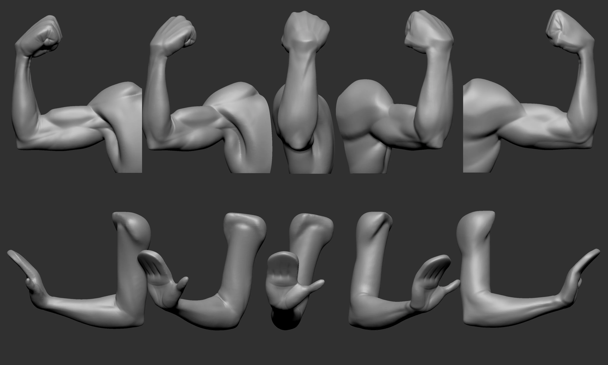
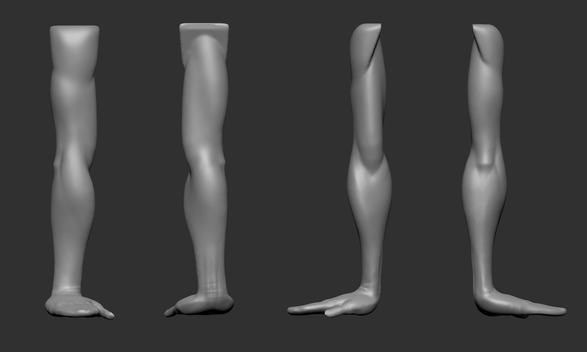
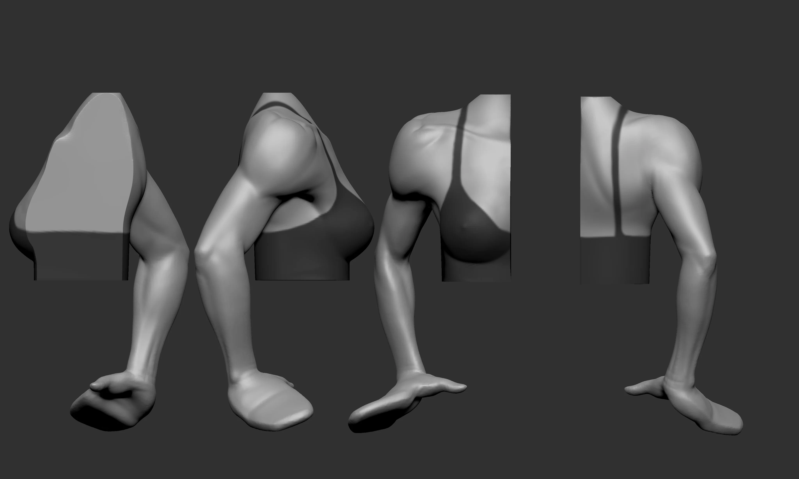
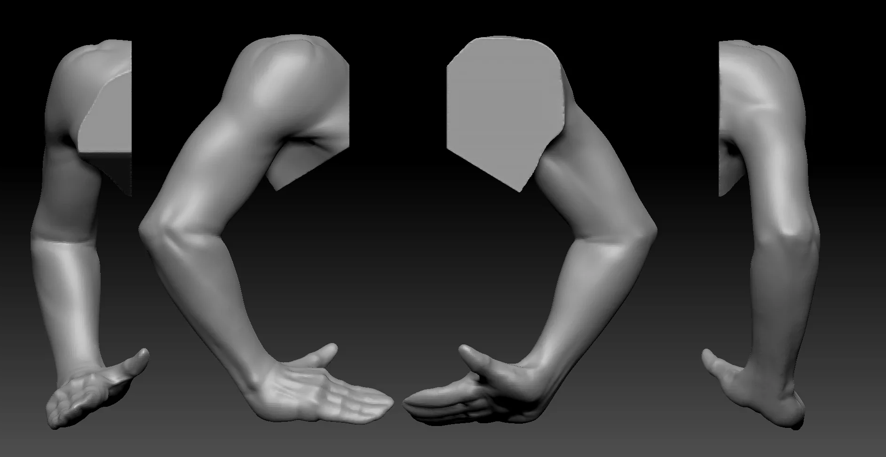
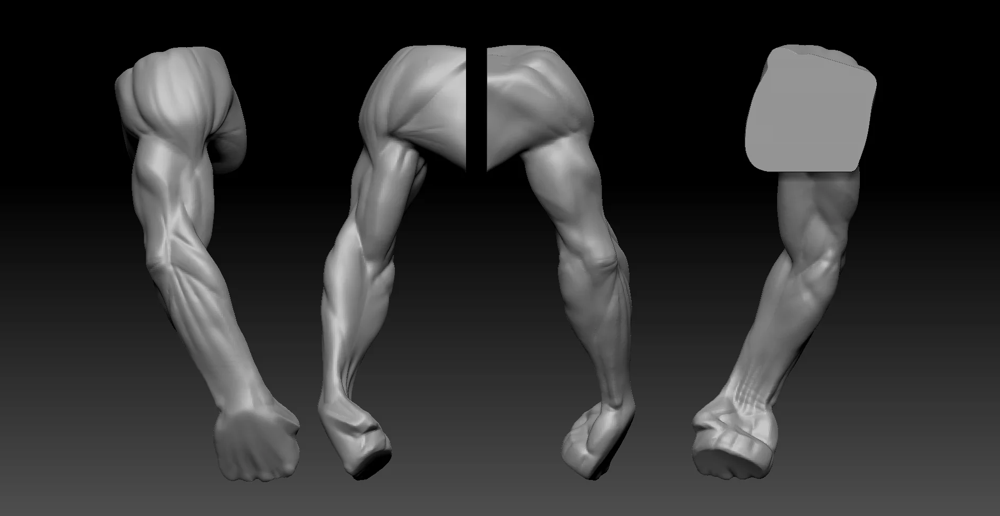
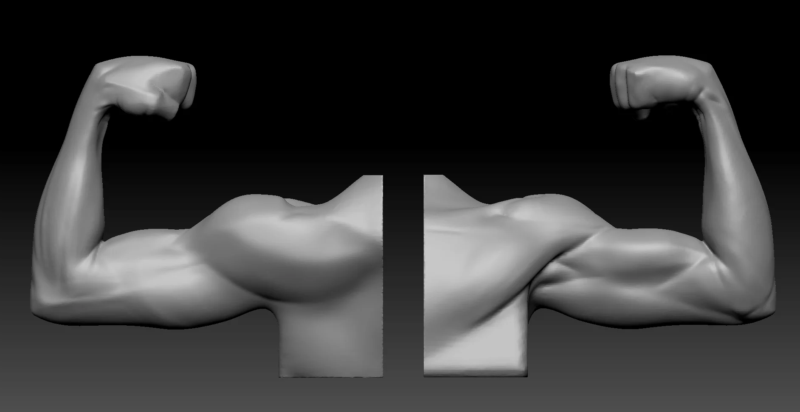

Two arm practice sessions — one focusing on the male form, one on female. Main challenge was keeping the deltoid-to-bicep transition readable without overworking it.


  
  
  
  
  
  
  


---

Free for personal use — grab the ZBrush file on Gumroad.

Download on Gumroad
