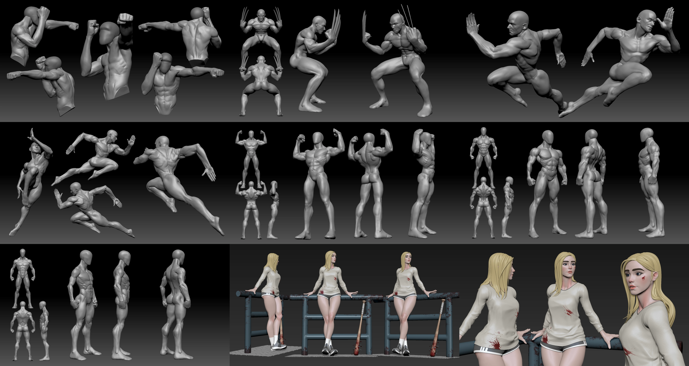
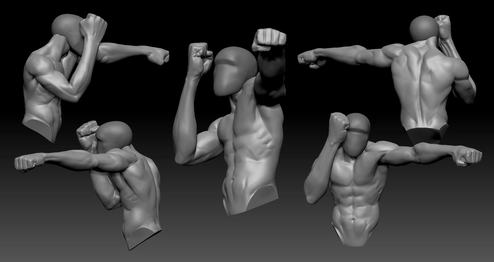
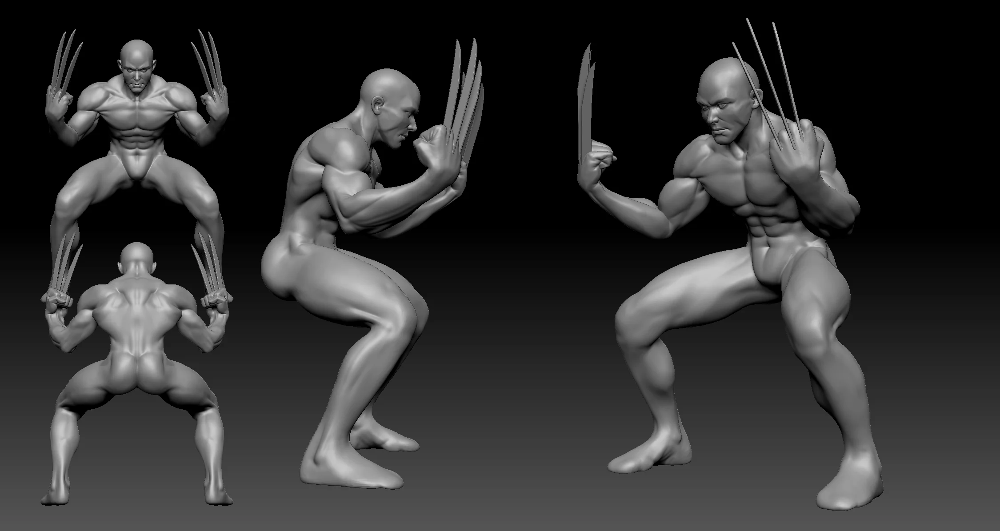
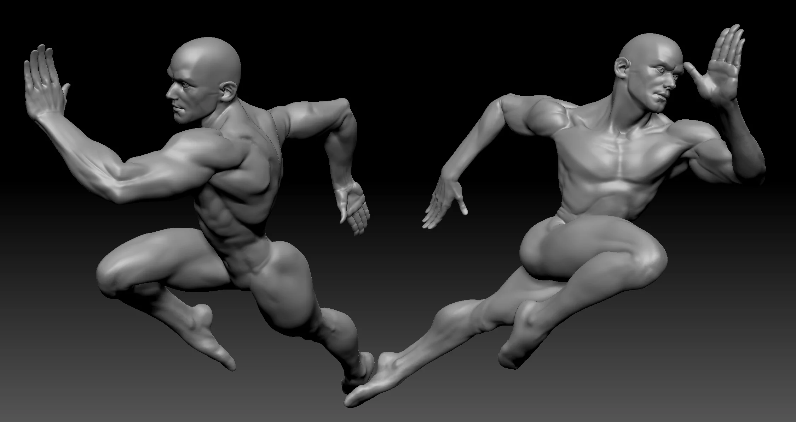
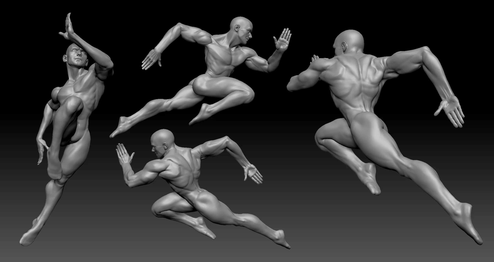
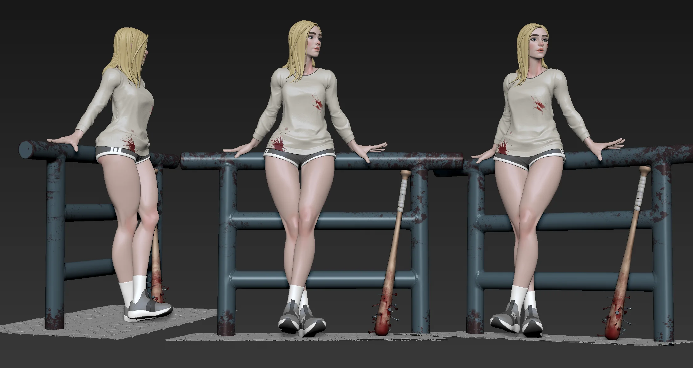
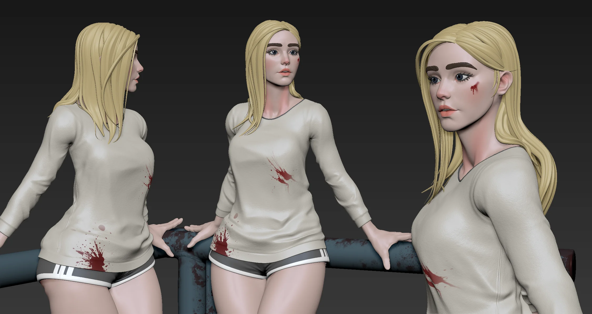

Full figure studies — male and female. This is where all the individual part studies get tested. Getting proportions to hold across the whole figure is a different problem than getting one body part right.


  


**Male**


  
  
  
  


**Female**


  
  


---

Free for personal use — grab the ZBrush file on Gumroad.

Download on Gumroad
