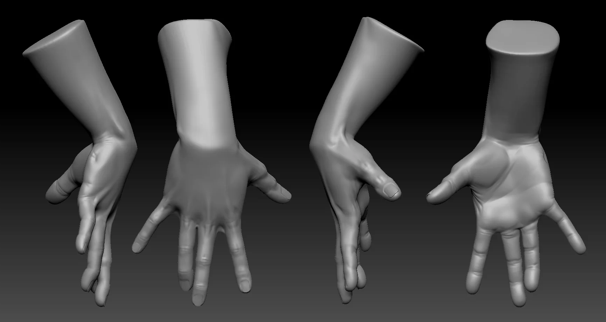
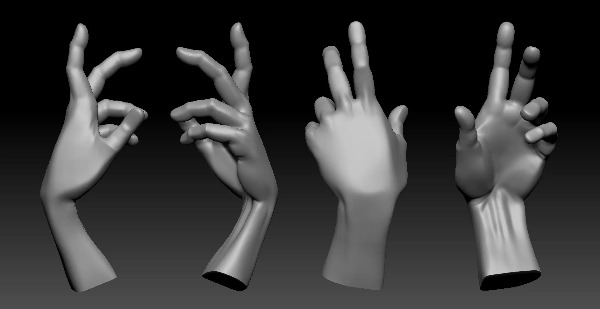

Hands are famously annoying. Practiced neutral male, neutral female, and a stylized version to see how far you can push proportions before it stops reading as a hand.


  
  
  
  
  
  


## Recent Practice

A few recent hands.


  
  
  


---

Free for personal use — grab the ZBrush file on Gumroad.

Download on Gumroad
