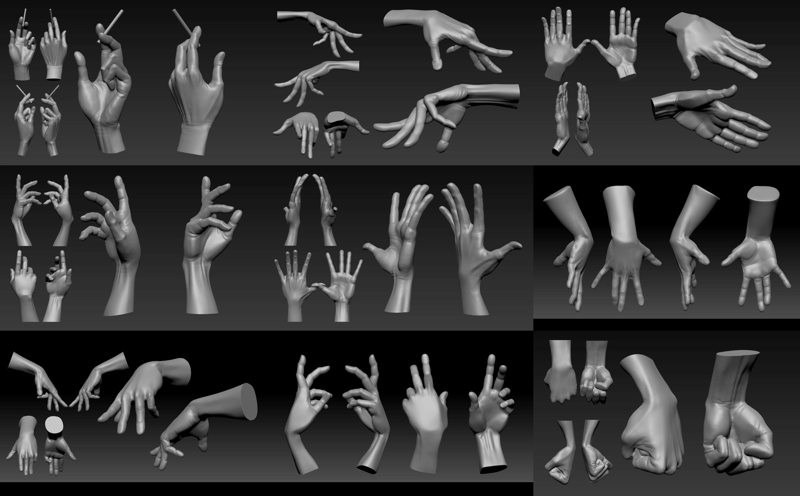
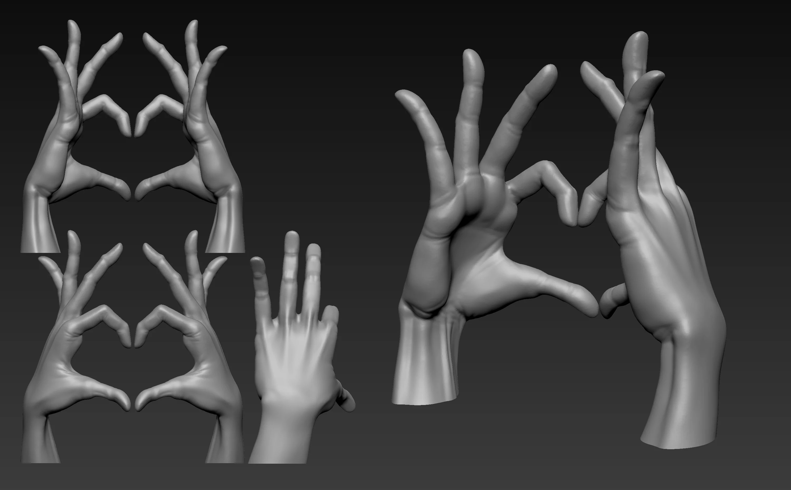
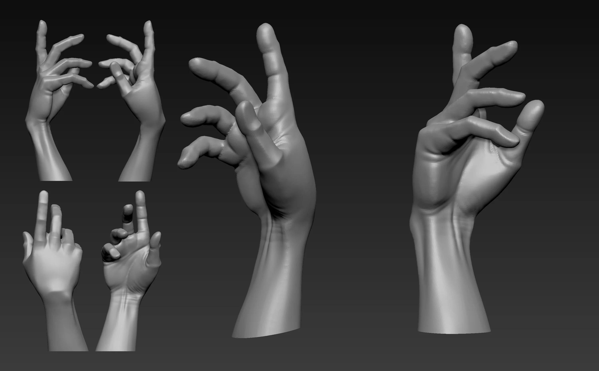
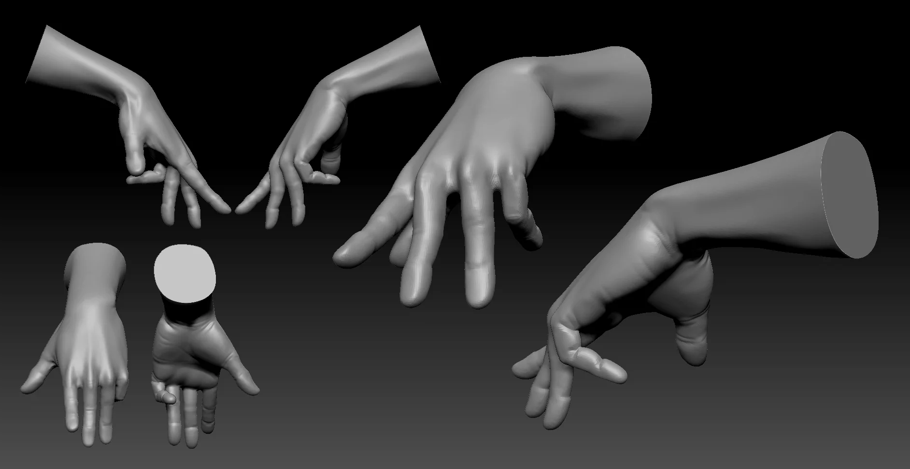

Hands are famously annoying. Practiced neutral male, neutral female, and a stylized version to see how far you can push proportions before it stops reading as a hand.

  

 

---

**Download files:** Coming soon.
