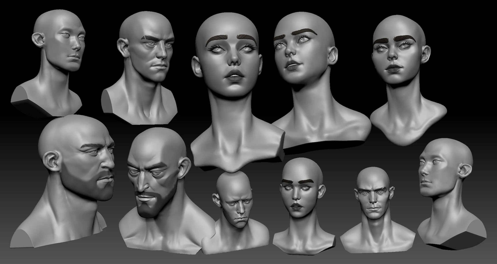
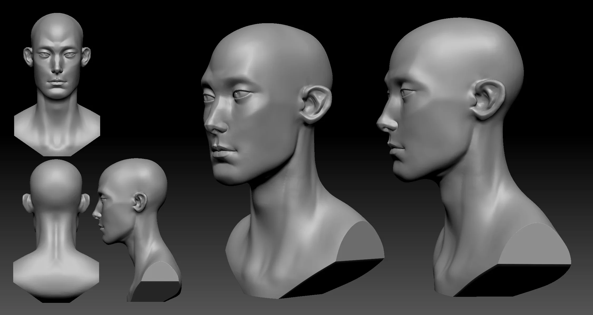
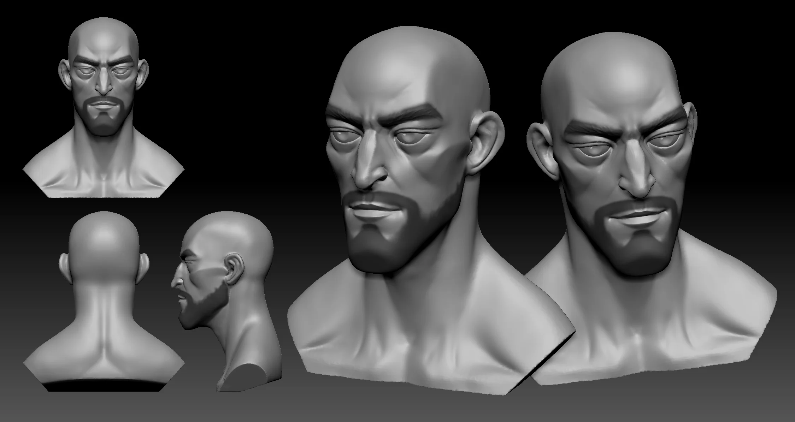
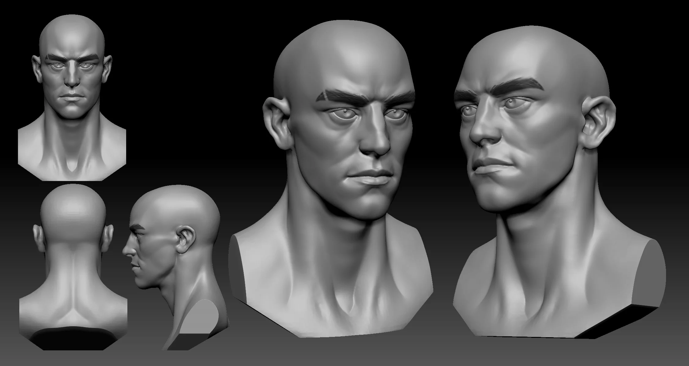
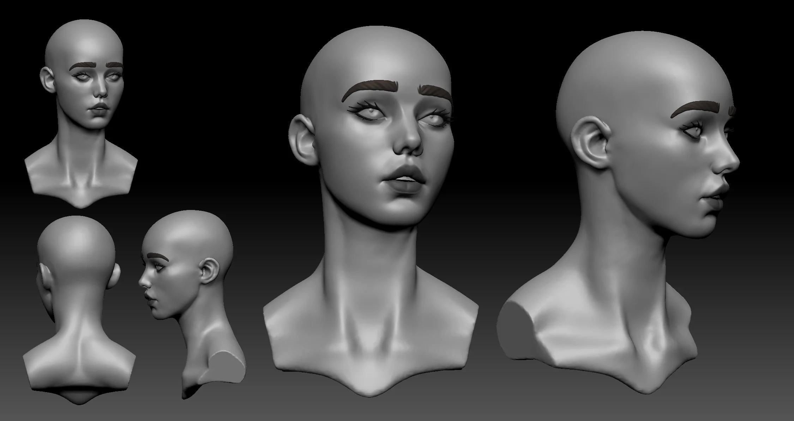
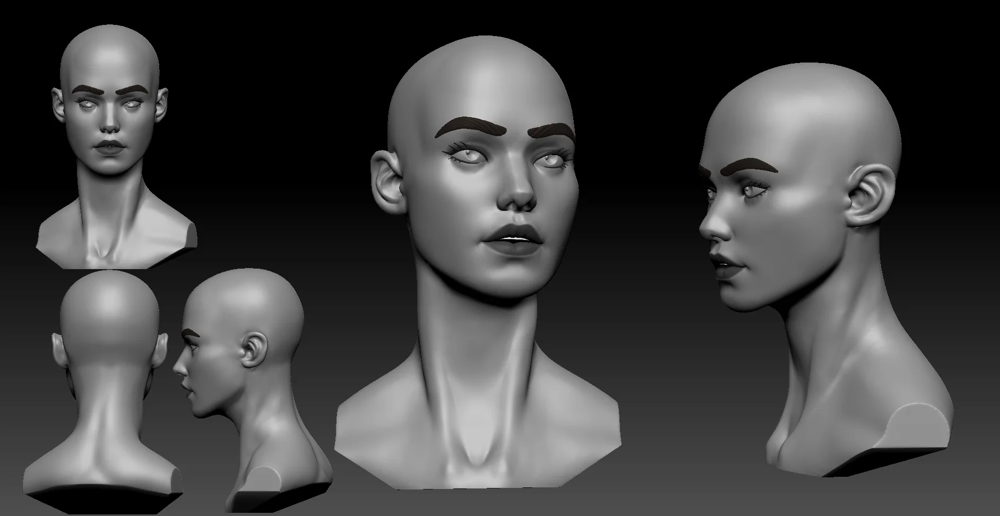

Two rounds of head anatomy. First pass was about getting the major landmarks right — brow ridge, zygomatic arch, chin. Second pass pushed into surface detail and expression.

  

 

---

**Download files:** Coming soon.
