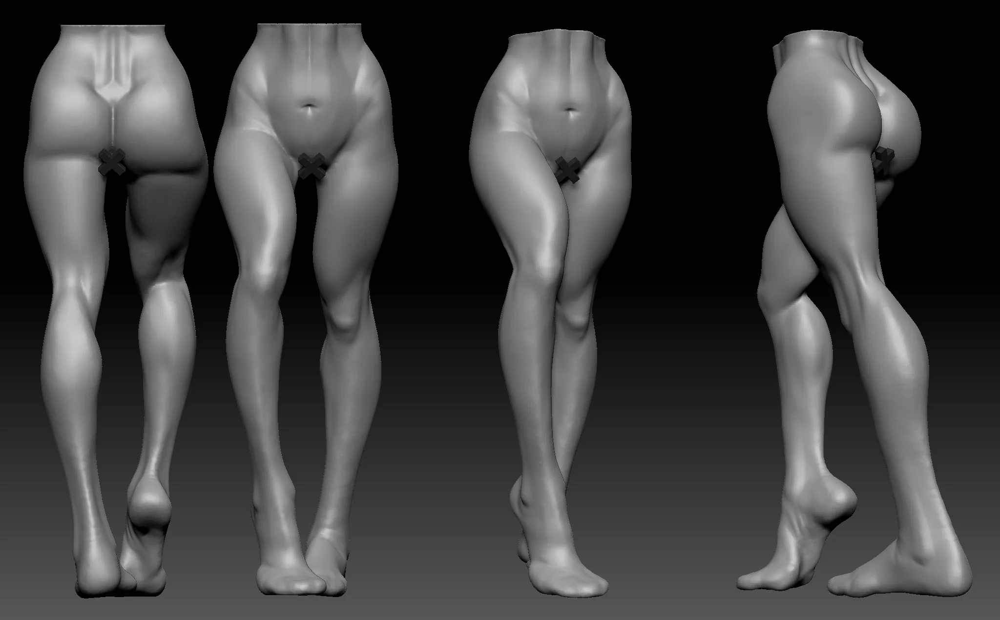
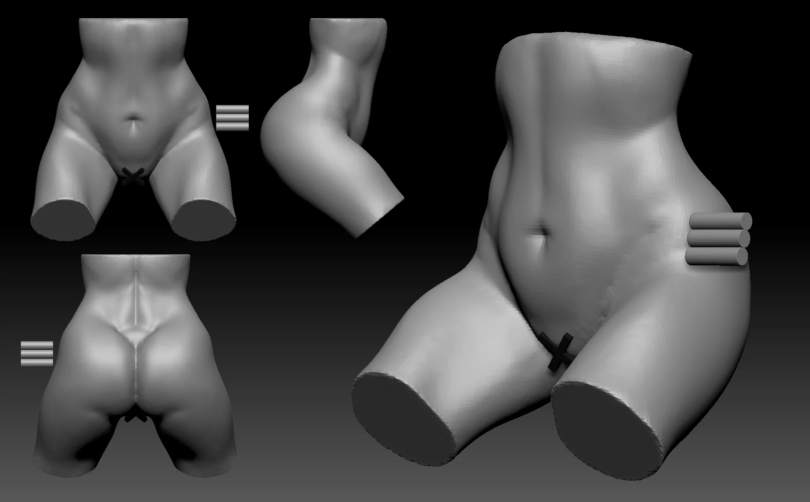
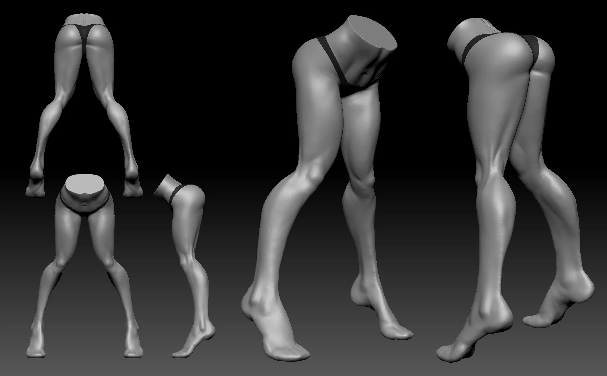

Legs, glutes, and feet across multiple sessions. Covered male, female, bent poses, and a semi-stylized écorché pass to understand the muscle wrapping before adding skin.


  
  
  
  
  
  
  


## Recent Practice

Recent leg and lower-body work.


  
  
  


---

Free for personal use — grab the ZBrush file on Gumroad.

Download on Gumroad
