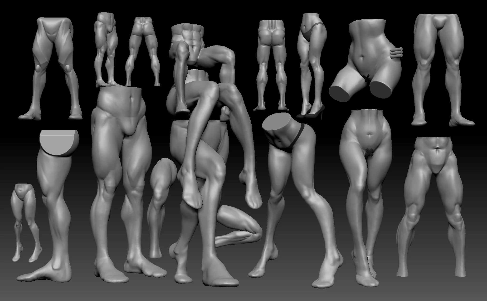
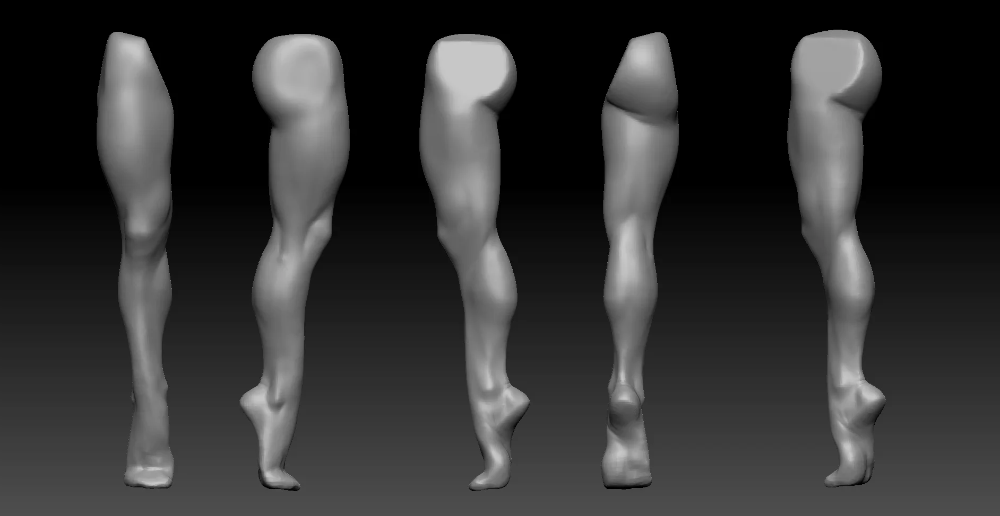
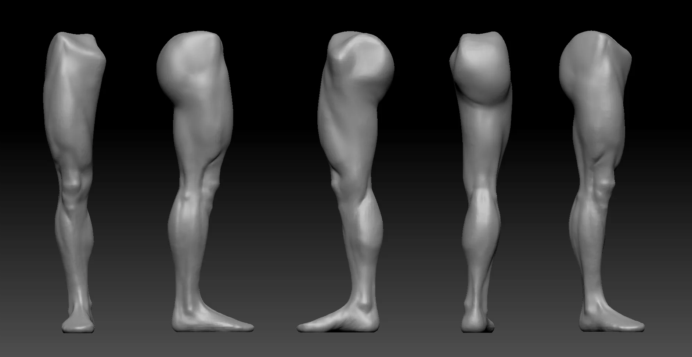
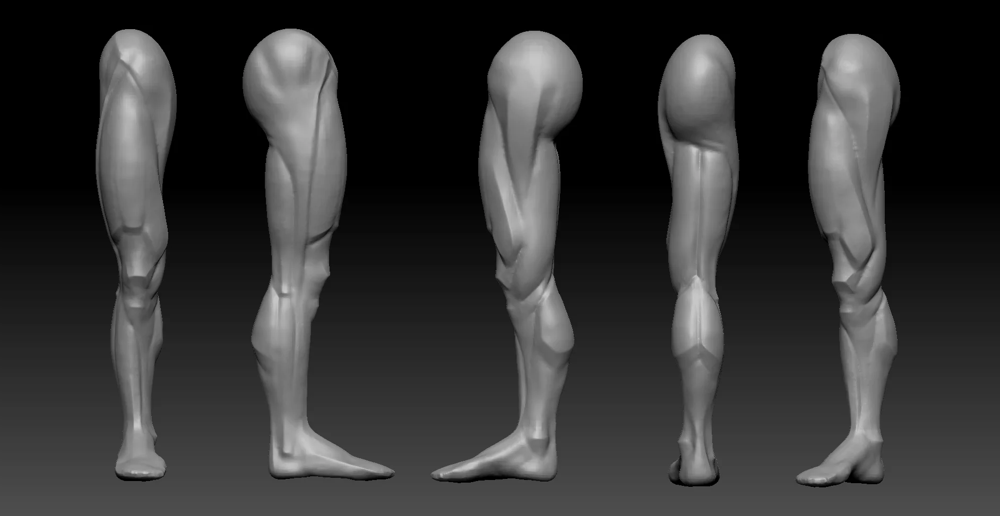
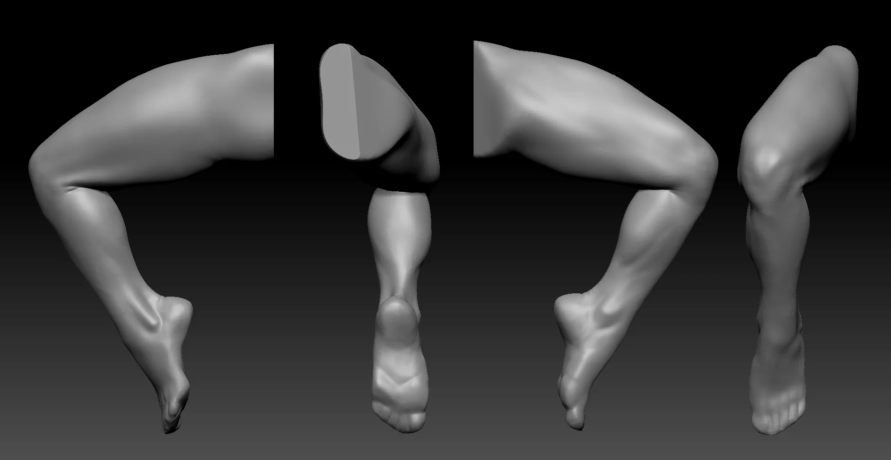
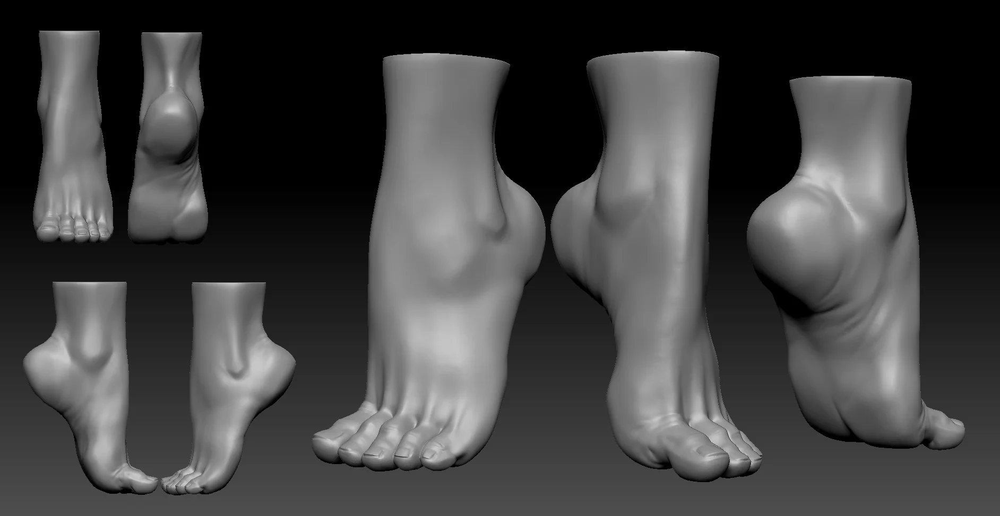
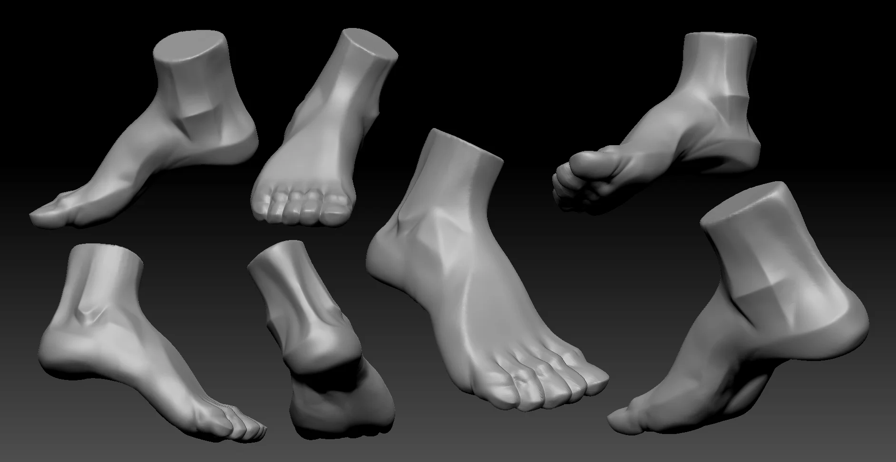

Legs, glutes, and feet across multiple sessions. Covered male, female, bent poses, and a semi-stylized écorché pass to understand the muscle wrapping before adding skin.

  

  

---

**Download files:** Coming soon.
