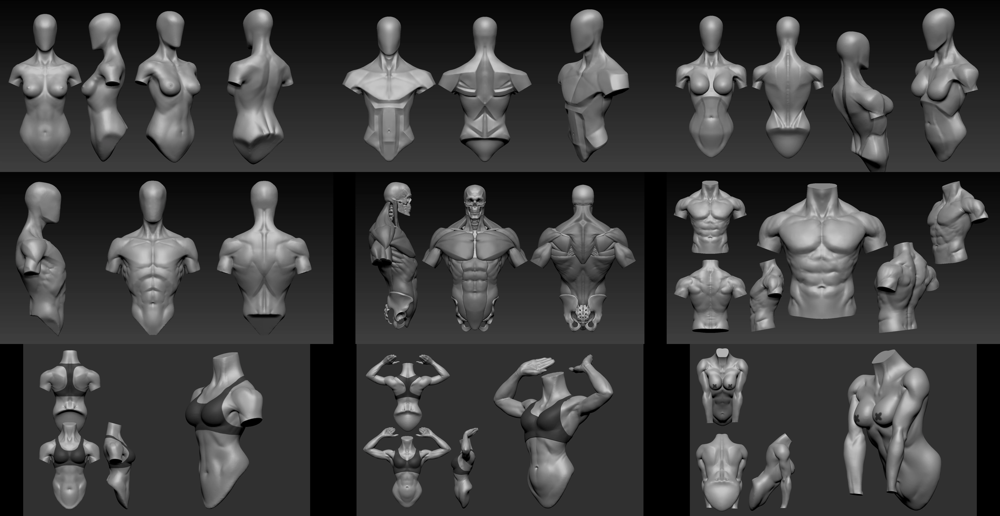
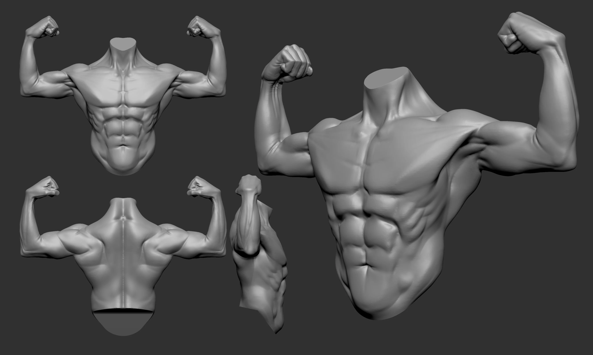
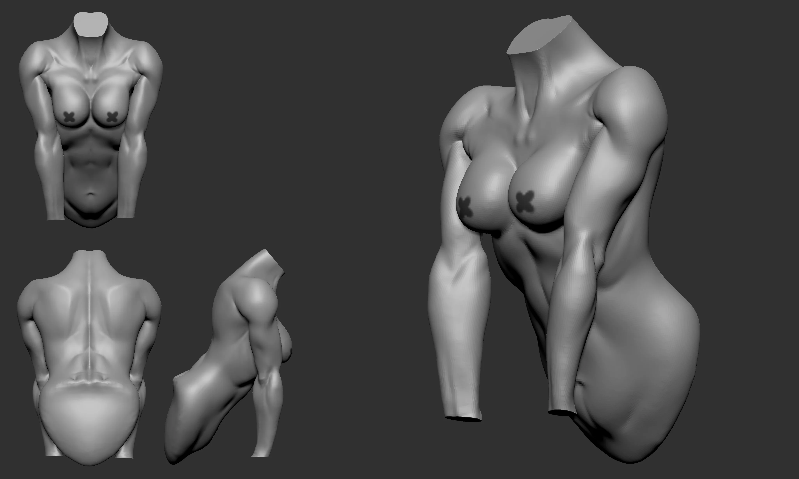
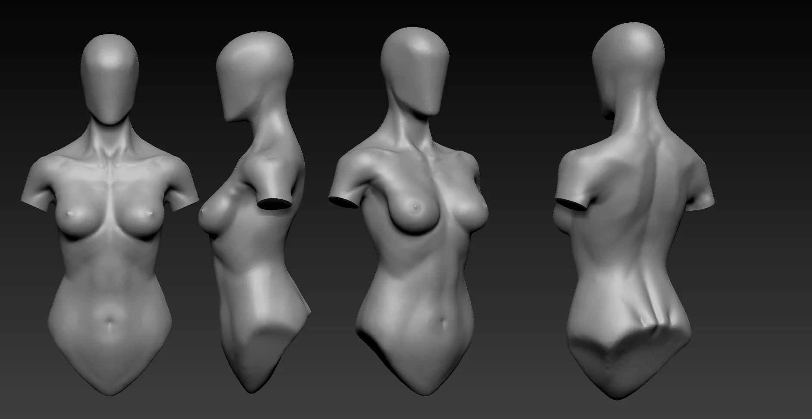
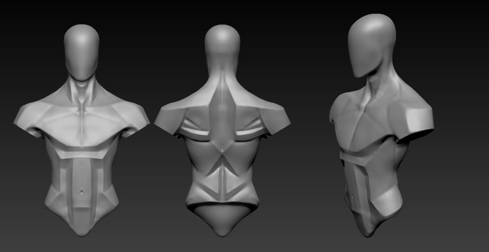
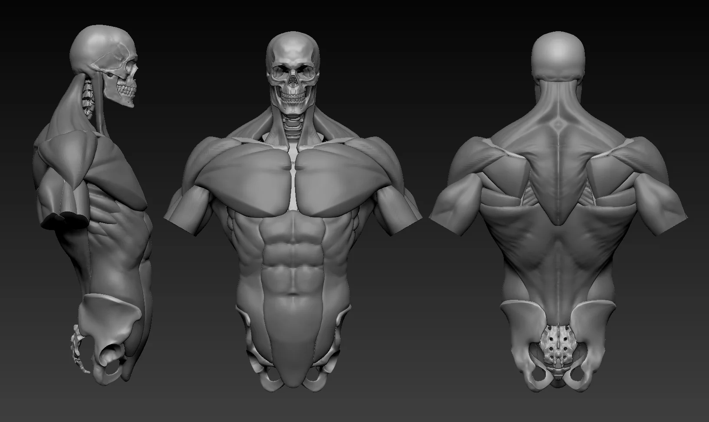

Torso studies covering male, female, and écorché. The planar version was useful for getting the big planes right before committing to surface detail.

  

 

---

**Download files:** Coming soon.
