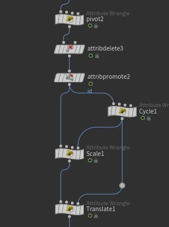



## Introduction

I recently took a motion design course on Rebelway, and I'd like to share some thoughts and insights on the techniques I learned. In this chapter, we will be working with packed geometry and how to apply transformations and scaling to it. Each individual button you see in the video consists of two distinct packed geometries.



This article will focus on four nodes: `pivot`, `cycle`, `scale`, `translation`.

---

### Re-define the pivot.
Keep in mind that each packed geometry has its own pivot. The goal is to scale the geometry from the bottom. However, the pivot is intrinsically set at the center of the packed geometry. Therefore, we need to offset the pivot by using the `setprimintrinsic` method.

After doing so, the whole geometry will shift position. This behavior might seem confusing at first, but let me explain. Imagine you are holding a cup by its handle with your arm pointing forward — the grip point is the pivot. If you were to hold the cup at its bottom instead, the cup's position is relatively higher than before, isn't it?

```c
float b[] = primintrinsic(0, "bounds", @ptnum);
vector pivot = primintrinsic(0, "pivot", @ptnum);

vector newPivot = set(@P.x, b[2], @P.z);
setprimintrinsic(0, "pivot", @ptnum, newPivot);
```

#### Position compensation
To maintain a correct animation, we need to move the geometry back to its original position by applying the offset back to `@P`. This ensures the geometry sits at the correct position with the new pivot attribute written.

```c
vector offset = newPivot - pivot;

// Compensation
v@P += offset;
```
---

### The drive (life cycle)
The next step is to create a driven attribute to control all the animation — the name is pretty self-explanatory. I should've mentioned this earlier, but we have an `age` attribute that wipes from right to left, with a range of approximately 0 to 8.0.

The key idea here is that offsets are applied sequentially to our driven attribute.

#### Primary offset
Each button consists of two packed geometries that share the same class number. This means we have a `class` attribute for each individual button. We can use this attribute to stagger or delay the animation by adding it to our `age` attribute.

```c
// class offset
float random_offset_frame = chf("random_offset_frame");
float random_offset = fit01(rand(@class+chi("random_offset_seed")), random_offset_frame*-1, 0);
f@offset = random_offset;
f@age += f@offset;
```

#### Secondary offset
Remember that we have 2 distinct packed geometries per button. We can assign a different `id` attribute to each one and use it to delay the scaling animation.

```c
if (@id == 1) {
    f@age -= chf("top_offset");
}
```

#### Setup drive attributes for different effects
For the translation animation, we only want to apply it to the top packed geometry. It's best to separate the two driven attributes into `trans_drive` and `scale_drive`. The final VEX code for the `cycle node` looks like this:

```c
// class offset
float random_offset_frame = chf("random_offset_frame");
float random_offset = fit01(rand(@class+chi("random_offset_seed")), random_offset_frame*-1, 0);
f@offset = random_offset;

f@age += f@offset;
f@trans_drive = fit01(f@age, 0, 1);
f@trans_drive = clamp(f@trans_drive, 0, 1);
f@trans_drive = chramp("remap_wipe", 1-f@trans_drive);


// Scale drive
// Top offset
if (@id == 1) {
    f@age -= chf("top_offset");
}

f@scale_drive = fit01(f@age, 0, 1);
f@scale_drive = clamp(f@scale_drive, 0, 1);
f@scale_drive = chramp("remap_wipe", 1-f@scale_drive);
```

---

### Apply animation
#### Apply scaling animation
The rest of the process is straightforward. We apply the `scale_drive` attribute to our packed geometry using the `setprimintrinsic` method.

```c
float t = point(3, "scale_drive", @ptnum);
f@drive = point(3, "trans_drive", @ptnum);

matrix3 m = primintrinsic(0, "transform", @ptnum);
vector scale = chv("scale");
scale = lerp(1, scale, t);

scale(m, scale);

setprimintrinsic(0, "transform", @ptnum, m);
```
#### Apply translation animation
The translation is even simpler — just modify the `P` attribute directly.
```c
float t = point(3, "trans_drive", @ptnum);

vector translate = chv("translate");
translate *= t;
@P += translate;
```
---
### Conclusion
This is a genuinely interesting and refreshing way to manipulate geometry. Honestly, I hadn't worked with packed geometry much before — the `primintrinsic` attributes can feel a bit intimidating at first. But I can definitely see the potential here. Instead of wrangling hundreds of points and primitives with a complex node setup, we only need to deal with a handful of them. It's an extremely powerful and efficient approach.