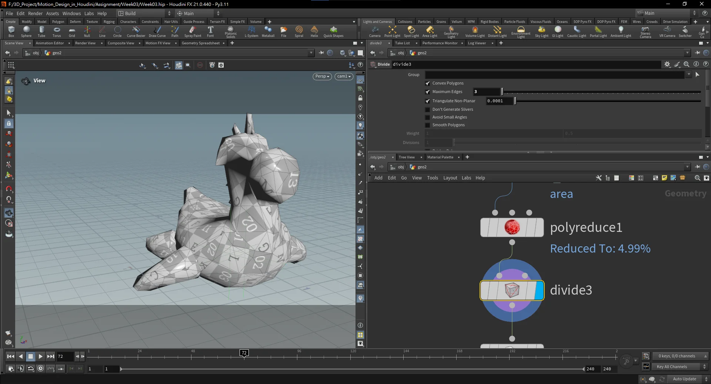
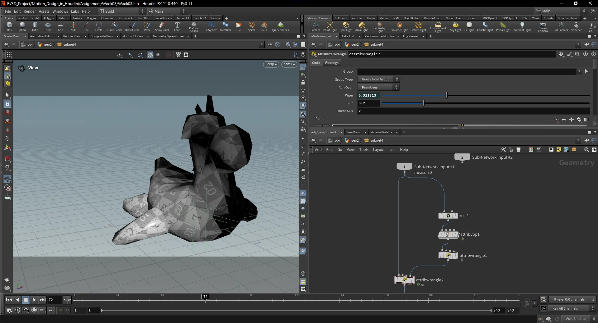
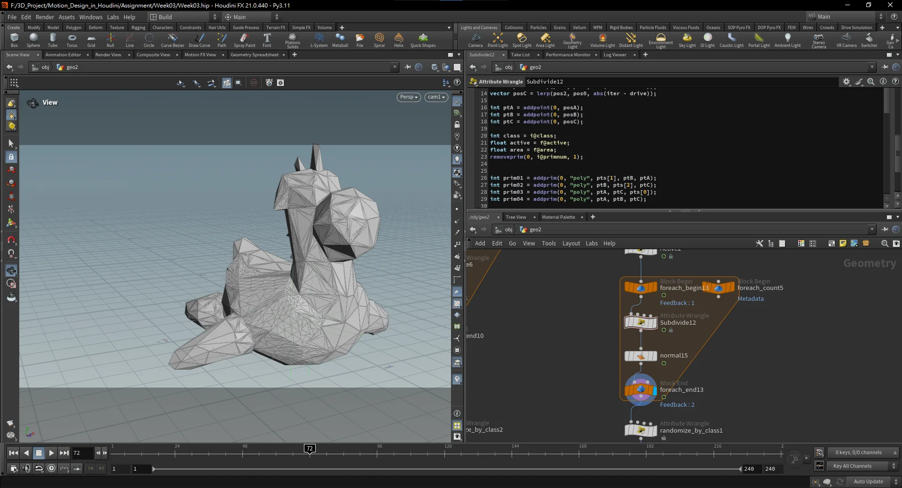
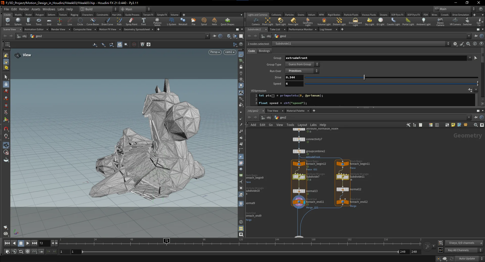
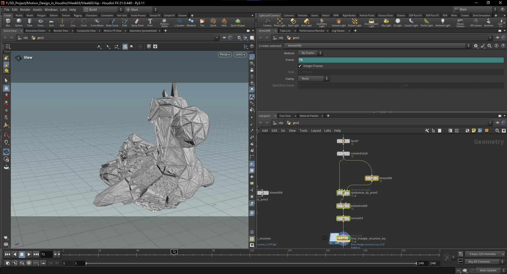



## Introduction

The goal: take a flat disc or a 3 dimentional geometry, recursively subdivide it into triangles, and extrude those triangles in layers —primary, secondary, tertiary —with each layer responding to the one above it. My setup diverges from the instructor's Chris in a few approaches, which I'll point out as we go.

---

## Setup Geometry



Nothing fancy here. Start with a flat disc, triangulate it. Everything downstream assumes triangles, so get that done early. You'll also want to initialize the attributes you'll be driving later —`active`, `class`, `area` —before the first subdivision pass. Set them up once, propagate them forward from there.

---

## Creating the Wipe Mask



The wipe mask is what drives activation. Triangles become "active" as the mask sweeps across, which triggers the subdivision and extrusion further downstream.

The key thing —and this tripped me up —is the `fit01(lin, blur, 1 - blur)` call. What that does is push the ramp input slightly inward from 0 and 1, so the mask never has a half-activated edge sitting at the extremes. Without it, you get gray zones at the beginning and end of the wipe that never fully resolve to clean black or white.

**Step 1 —Compute bounds per prim, push to detail:**

```c
float b[] = primintrinsic(0, "bounds", @primnum);

f[]@b = b;

f@x1 = b[0];
f@x2 = b[1];
f@y1 = b[2];
f@y2 = b[3];
f@z1 = b[4];
f@z2 = b[5];

setdetailattrib(0, "xmin", f@x1, "min");
setdetailattrib(0, "xmax", f@x2, "max");

setdetailattrib(0, "ymin", f@y1, "min");
setdetailattrib(0, "ymax", f@y2, "max");

setdetailattrib(0, "zmin", f@z1, "min");
setdetailattrib(0, "zmax", f@z2, "max");
```

**Step 2 —Map each prim's position into a 0— wipe value:**

```c
vector pos = prim(3, "P", @primnum);

float wipe = ch("wipe");
float blur = ch("blur");

float xmin = detail(3, "xmin");
float xmax = detail(3, "xmax");
float ymin = detail(3, "ymin");
float ymax = detail(3, "ymax");
float zmin = detail(3, "zmin");
float zmax = detail(3, "zmax");

float lin;

string axis = chs("linear_axis");

if (axis == "x")
    lin = fit(pos.x, xmin, xmax, 0, 1);

if (axis == "y")
    lin = fit(pos.y, ymin, ymax, 0, 1);

if (axis == "z")
    lin = fit(pos.z, zmin, zmax, 0, 1);

f@org_dist = fit01(lin, blur, 1 - blur);
f@ramped_dist = 1 - chramp("ramp", f@org_dist);

@Cd = f@ramped_dist;
//@Cd = org_dist;
```

---

## Primary Recursive Subdivision



This is where things get interesting. Each triangle gets split into four smaller ones —the classic midpoint subdivision where you cut each edge and connect them. The center piece is the "inner" triangle; the three corners are the "outer" ones.

My setup uses the `iteration` detail attribute to alternate rotation direction. Since there are only two iterations, each triangle ends up either going clockwise or counterclockwise —which gives us that satisfying spin in the animation.

The other thing I made sure to do: write all the original prim attributes (`class`, `active`, `area`, `iter`) onto the four new prims right after creation. If we skip this, those attributes don't exist on the new geometry and everything downstream breaks silently.

```c
float drive = f@active;
drive = clamp(drive, 0.01, 0.99);

int pts[] = primpoints(0, @primnum);
int iter = detail(1, "iteration");

vector pos0 = point(0, "P", pts[0]);
vector pos1 = point(0, "P", pts[1]);
vector pos2 = point(0, "P", pts[2]);

vector posA = lerp(pos0, pos1, abs(iter - drive));
vector posB = lerp(pos1, pos2, abs(iter - drive));
vector posC = lerp(pos2, pos0, abs(iter - drive));

int ptA = addpoint(0, posA);
int ptB = addpoint(0, posB);
int ptC = addpoint(0, posC);

int class = i@class;
float active = f@active;
float area = f@area;
removeprim(0, i@primnum, 1);

int prim01 = addprim(0, "poly", pts[1], ptB, ptA);
int prim02 = addprim(0, "poly", ptB, pts[2], ptC);
int prim03 = addprim(0, "poly", ptA, ptC, pts[0]);
int prim04 = addprim(0, "poly", ptA, ptB, ptC);

setprimattrib(0, "iter", prim01, iter, "set");
setprimattrib(0, "iter", prim02, iter, "set");
setprimattrib(0, "iter", prim03, iter, "set");
setprimattrib(0, "iter", prim04, iter, "set");

setprimattrib(0, "class", prim01, class, "set");
setprimattrib(0, "class", prim02, class, "set");
setprimattrib(0, "class", prim03, class, "set");
setprimattrib(0, "class", prim04, class, "set");

setprimattrib(0, "active", prim01, active, "set");
setprimattrib(0, "active", prim02, active, "set");
setprimattrib(0, "active", prim03, active, "set");
setprimattrib(0, "active", prim04, active, "set");

setprimattrib(0, "area", prim01, area, "set");
setprimattrib(0, "area", prim02, area, "set");
setprimattrib(0, "area", prim03, area, "set");
setprimattrib(0, "area", prim04, area, "set");
```

The `clamp(drive, 0.01, 0.99)` at the top. You need that to prevent degenerate triangles at the extremes —if the lerp value hits exactly 0 or 1, two points collapse onto each other and you get zero-area prims.

---

## Primary & Secondary Extrusion


The extrusion amount is randomized per prim and then multiplied by `active` run through a ramp —so extrusion only kicks in as the wipe activates each triangle.

One thing worth setting up now even if you don't need it yet: in the PolyExtrude node, enable Extrude Front Group and Extrude Side Group. Having them means you can target specific faces in the later extrusion passes.

```c
f@amt_B = fit01(rand(@primnum + 1111), 0.05, 0.5);
int success;
f@activeB = primattrib(3, "active", @primnum, success);
f@amt_B *= chramp("remap", f@activeB);
f@amt_B += 0.001;
```

The `+= 0.001` at the end keeps the extrusion amount above zero. Zero extrusion collapses faces and causes issues you don't want to debug.

---

## Secondary Subdivision



The second subdivision pass works on geometry that came out of the primary extrusion. This time, instead of splitting each triangle into four, I split it into six. And instead of `lerp`-based animation, this pass uses `cos` to drive the motion.

You could argue all the subdivision should happen at the start. And you'd probably be right. But by doing things sequentially, you can cache out and verify the primary motion before committing to secondary detail.

```c
int pts[] = primpoints(0, @primnum);

float speed = chf("speed");
float offset = fit(rand(@class2), 0, 1, -1, 1);
float drive = cos(@Time * speed - offset) * 0.5 + 0.5;

vector pos0 = point(0, "P", pts[0]);
vector pos1 = point(0, "P", pts[1]);
vector pos2 = point(0, "P", pts[2]);

int ptA = addpoint(0, (pos0 + pos1 + pos2)/3);

int ptB1 = addpoint(0, lerp((pos0 + pos1)/2, pos0, drive));
int ptB2 = addpoint(0, lerp((pos0 + pos1)/2, pos1, drive));

int ptC1 = addpoint(0, lerp((pos0 + pos2)/2, pos0, drive));
int ptC2 = addpoint(0, lerp((pos0 + pos2)/2, pos2, drive));

int ptD1 = addpoint(0, lerp((pos1 + pos2)/2, pos1, drive));
int ptD2 = addpoint(0, lerp((pos1 + pos2)/2, pos2, drive));

int class = i@class;
int class2 = i@class2;
int extrudeFront = i@group_extrudeFront;
float active = f@active;
float activeB = f@activeB;
float area = f@area;

removeprim(0, @primnum, 0);

int prim01 = addprim(0, "poly", ptA, ptB1, ptB2);
int prim02 = addprim(0, "poly", ptA, ptC2, ptC1);
int prim03 = addprim(0, "poly", ptA, ptD1, ptD2);
int prim04 = addprim(0, "poly", ptB1, pts[1], ptD1, ptA);
int prim05 = addprim(0, "poly", ptB2, ptA, ptC1, pts[0]);
int prim06 = addprim(0, "poly", ptA, ptD2, pts[2], ptC2);

int innerPrims[] = array(prim01, prim02, prim03, prim04, prim05, prim06);

foreach(int prim; innerPrims) {
    setprimattrib(0, "class", prim, class, "set");
    setprimattrib(0, "class2", prim, class2, "set");
    setprimattrib(0, "active", prim, active, "set");
    setprimattrib(0, "activeB", prim, activeB, "set");
    setprimattrib(0, "area", prim, area, "set");
    setprimattrib(0, "drive", prim, area, "set");
    setprimgroup(0,  "extrudeFront", prim, extrudeFront,"set");
}
```

---

## Tertiary Extrusion



The third extrusion layer reads from `activeB` instead of `active`, so it's offset one step behind the secondary pass. The amount is also affected by the `area` attribute —smaller triangles extrude less, which stops tiny geometry from turning into visual noise.

```c
f@amt_C = fit01(rand(i@id2 + 1111), 0.5, 2);
int success;
f@activeC = primattrib(3, "activeB", i@primnum, success);
f@amt_C *= chramp("remap", f@activeC);
f@amt_C *= fit01(f@area, 0.15, 1);
f@amt_C += 0.001;
```

---

## Conclusion
The recursive subdivision setup is genuinely satisfying once it's working. The key insight is using `iteration` as a behavioral switch —alternating clockwise vs counterclockwise rotation comes for free because of how `abs(iter - drive)` flips between the two iterations.

Thanks to Chris for the course —the layered extrusion structure is such a cool pattern worth keeping in the toolkit.

