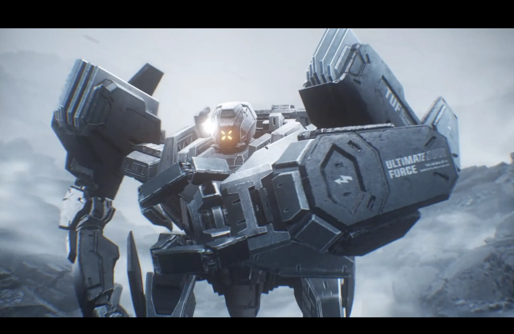
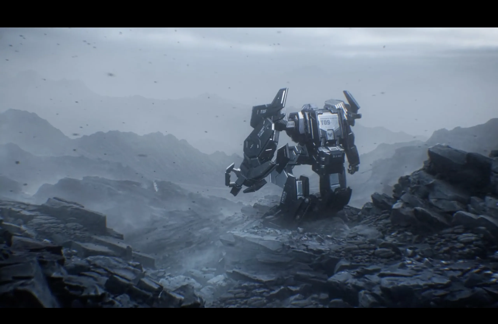
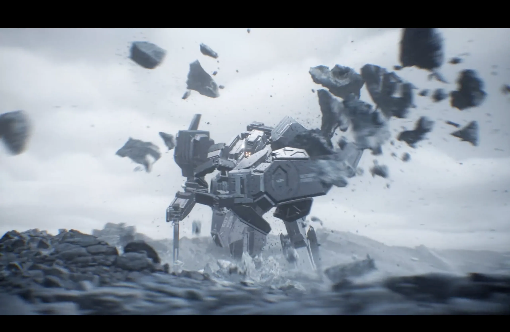
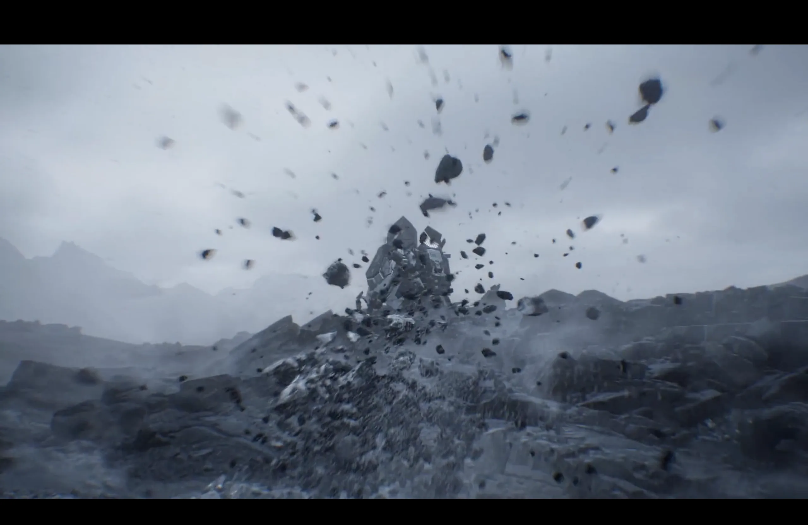



## Overview

A commercial done at Moonshine Animation for ASUS TUF. The whole thing runs in Unreal Engine, but the effects were created in Houdini.

---

## My Contributions

| Effect | Pipeline |
|---|---|
| Smoke simulation | Houdini → flipbook → UE shader |
| RBD simulation | Houdini → vertex animation texture → UE |

---

## Breakdown

### Smoke

The smoke is done as a flipbook. I simulate it in Houdini, render out a sprite sheet of the frames, then set up a shader in Unreal that plays through them. It's not a real-time sim — Unreal is just playing back pre-rendered frames — but it looks convincing and runs fast.

  

    
    
Fast fog

  

  

    
    
Fog valley

  

---

### RBD

The rock destruction is simulated in Houdini as a standard RBD sim, then baked out as a vertex animation texture (VAT). Houdini encodes the per-vertex position and normal data of every frame into a texture, then a shader in Unreal reads that texture and deforms the mesh accordingly. 

  

    
    
RBD - Simulation

  

  

    
    
RBD — Simulation

  

---

