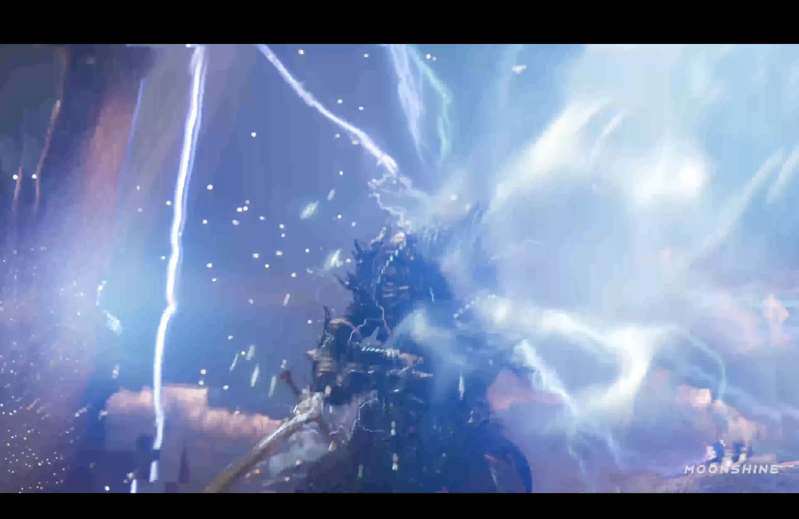
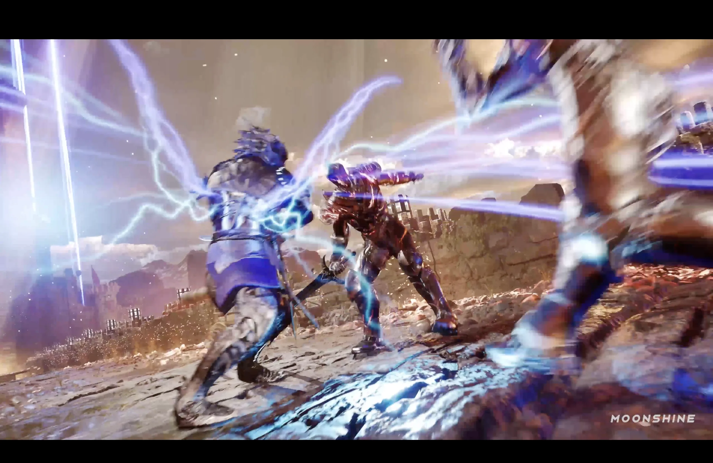
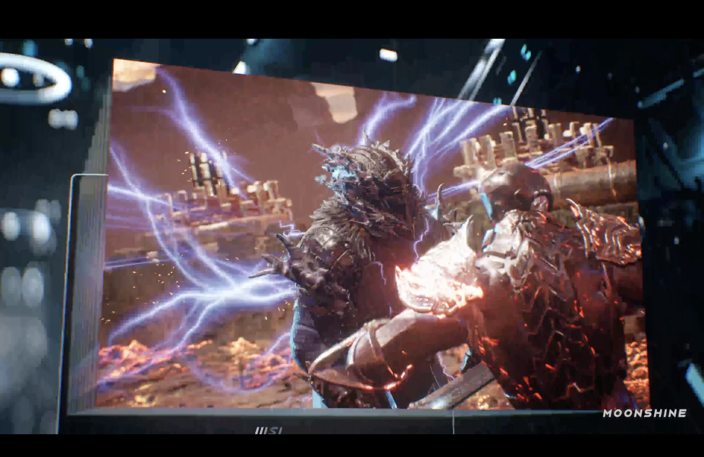
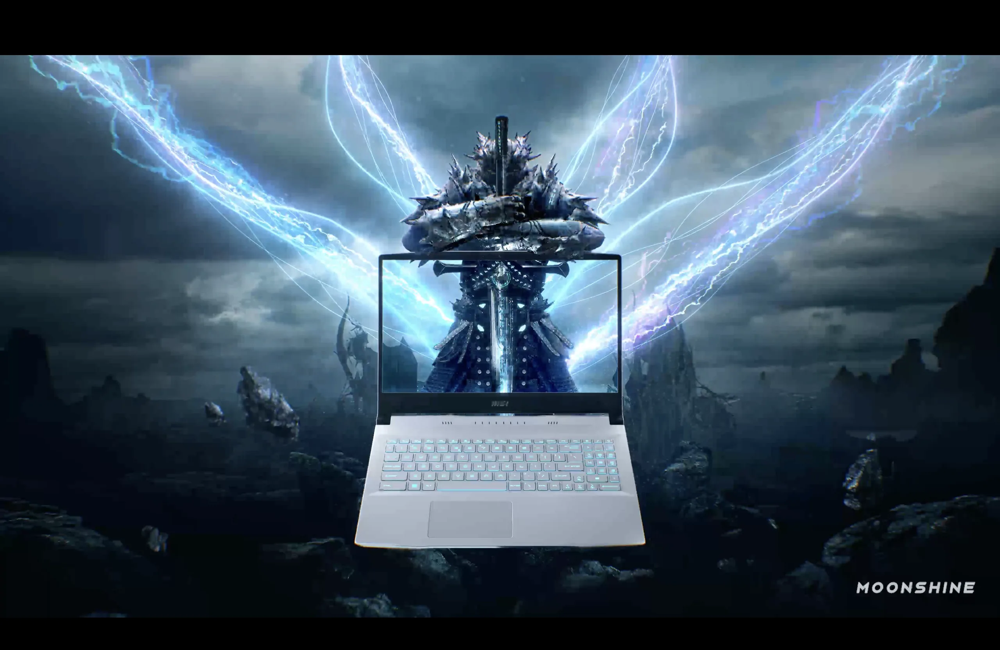
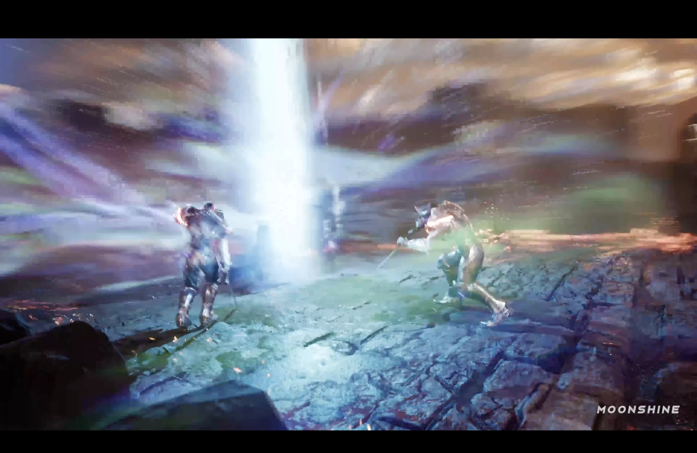
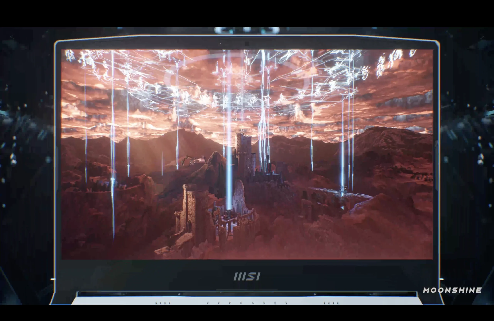
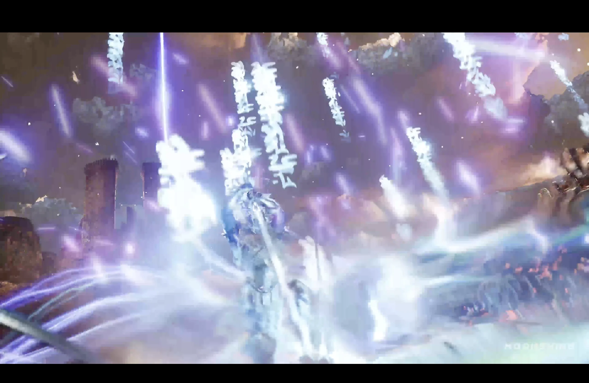



## Overview

A commercial done at **Moonshine Animation** for MSI. The whole thing is built in **Unreal Engine** — no Houdini this time. I handled three effects: the lightning wing, the light beams, and the aura.

---

## My Contributions

| Effect |
|---|
| Lightning wing |
| Light beam |
| Aura effect |

---

## Breakdown

### Lightning Wing

The signature effect of the spot. Big arcing wings of lightning spreading out from the character. It's most visible in the hero shot — the character standing behind the laptop with the wings fully extended. It also shows up in the combat scenes, where I needed it to feel more dynamic and reactive rather than just decorative.

  

    
    
Lightning wing — close-up

  

  

    
    
Lightning wing — combat scene

  

  

    
    
Combat

  

  

    
    
Hero key art

  

---

### Light Beam

Two beam moments. One is a tight combat shot — a pillar of white light crashing down between two fighters. The other is a wider landscape shot on the laptop screen, beams raining down on a castle. Different scales, same idea.

  

    
    
Light beam

  

  

    
    
Light beams — landscape

  

---

### Aura Effect

The aura wraps around the character — purple and white energy with text scrolling through it.

