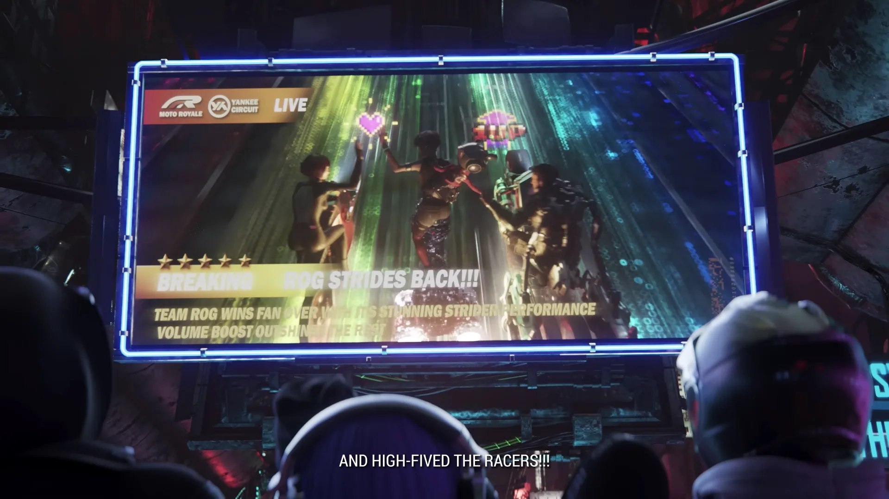
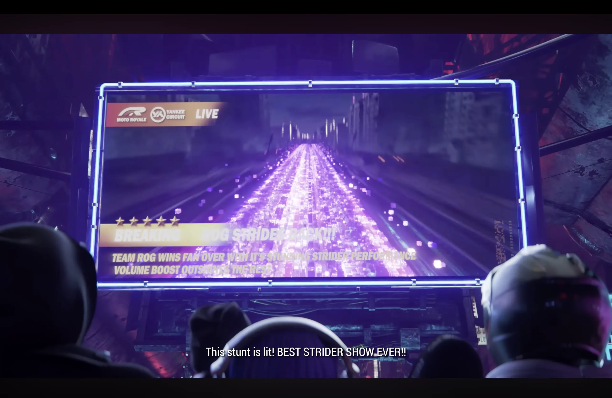
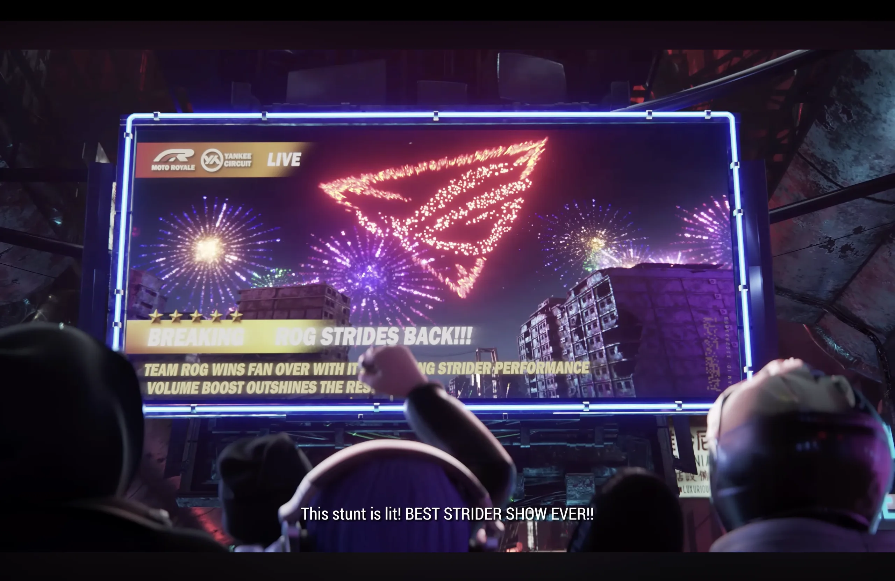
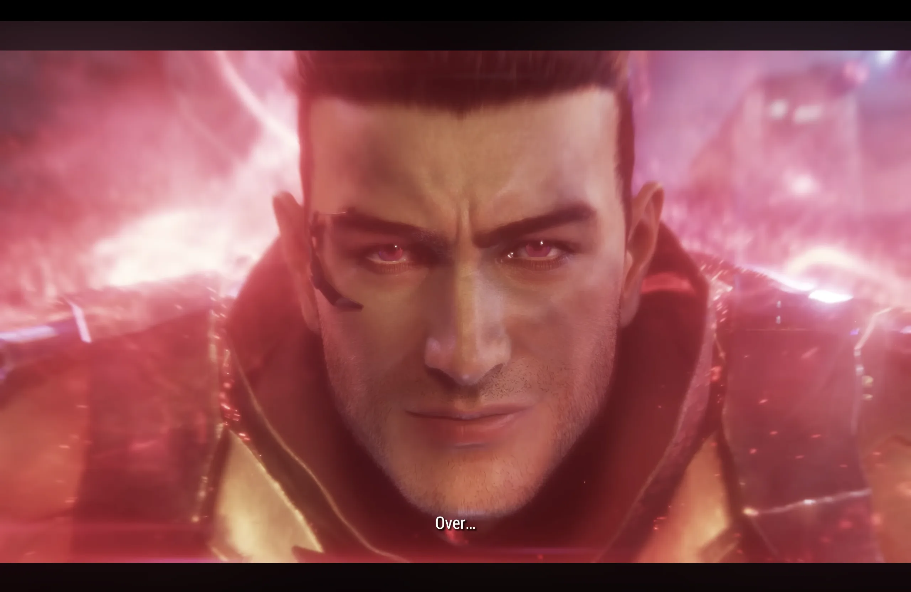
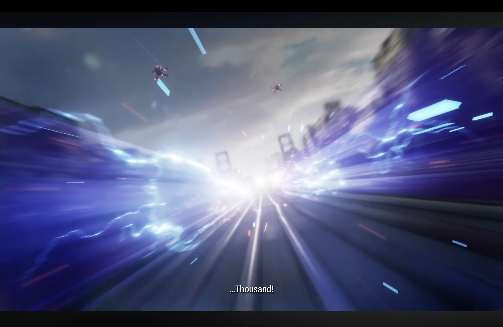
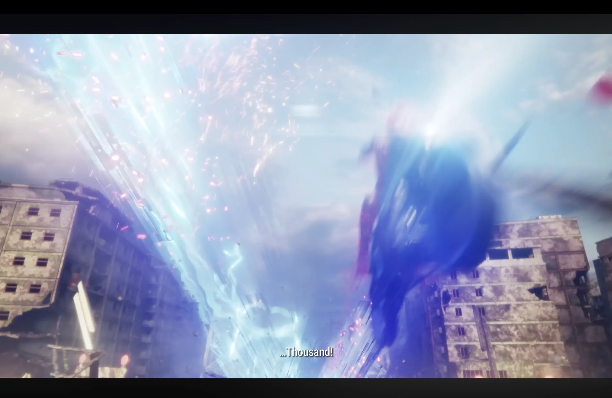
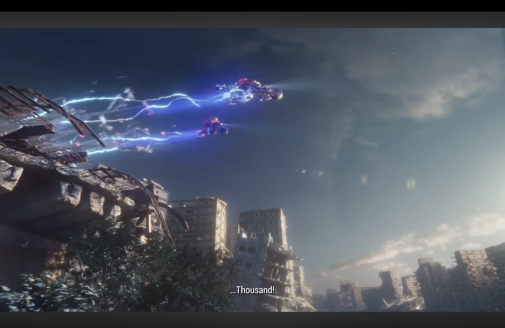
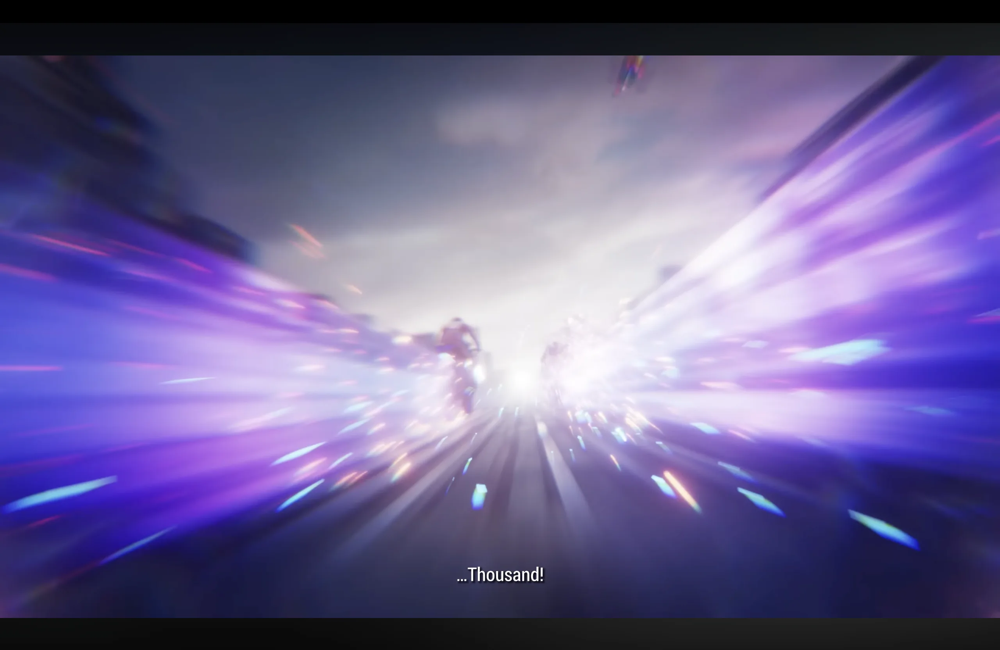
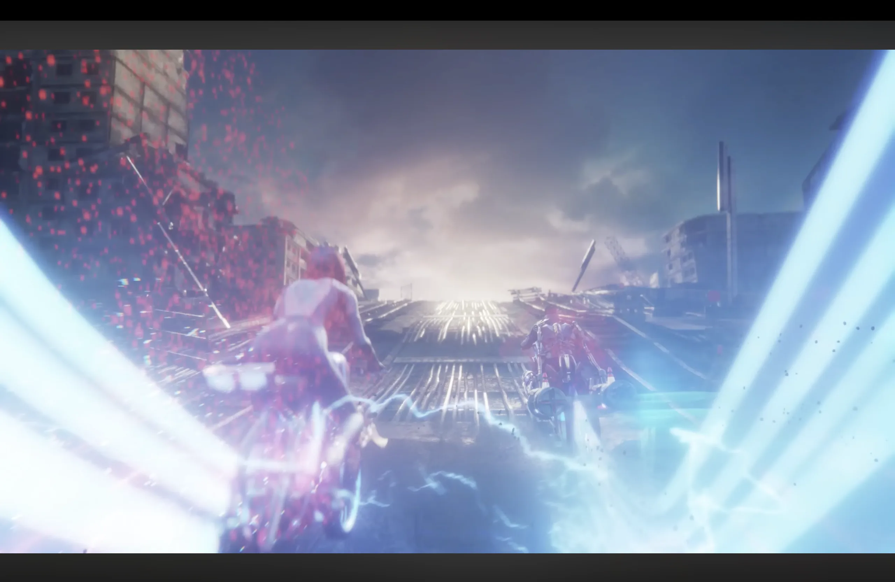



## Overview

**ROG | RE:SET** is a commercial cinematic produced at **Moonshine Animation** for ASUS Republic of Gamers.

My role focused entirely on the **VFX side**: designing and simulating the effects that punctuate the key story beats. Sparks, lightning strikes, every burst of fireworks in this piece went through Houdini.

---

## My Contributions

| Effect |
|---|
| Rainbow effect |
| Fireworks & particle simulation |
| Smoke simulation |
| Lightning effect |
| Pixelation effect |

---

## Breakdown

### Rainbow Effect

The rainbow streaks appear on the live broadcast screen during the crowd sequence — a wave of colour washing over the tracks. The effect needed to feel vibrant and slightly surreal to match the cyberpunk aesthetic of the world.

---

### Fireworks & Particle Simulation

Two distinct fireworks moments in the spot. The first is a pixelated rainbow track. The second is the hero beat: the ROG logo igniting in the sky as a fireworks burst, a centrepiece shot that needed to read clearly.

  

    
    
Pixelated trail — race track sequence

  

  

    
    
ROG logo fireworks — hero beat

  

---

### Lightning Effect & Speed

The lightning and tron-like trail runs through several shots — from close on the character's face as energy crackles around him, to wide city shots where arcs tear across the skyline.

  

    
    
Character close-up — energy surge

  

  

    
    
Lightning on the highway

  

  

    
    
Lightning burst — urban combat

  

  

    
    
Lightning arc — wide city shot

  

  

    
    
Speed effect — race sequence

  

  

    
    
Tron-like effect and lightning — transition

  

---

## Reflection

This was one of the more demanding commercial projects I've worked on — high visual bar, and a lot of effects needing to coexist in the same frame without fighting each other. A lot of iteration went into the seeding and damping parameters to get the shapes to read well on screen.
