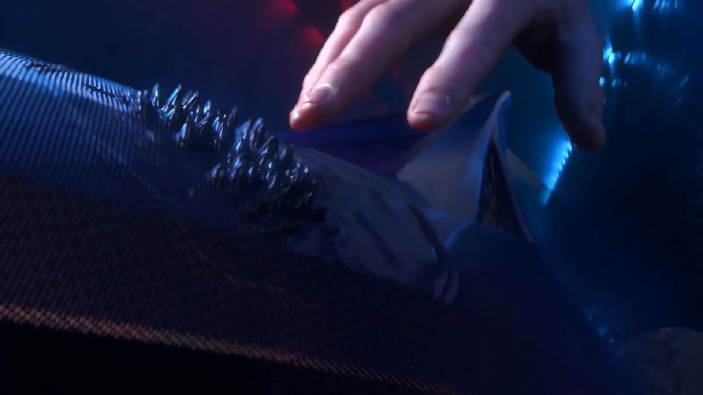
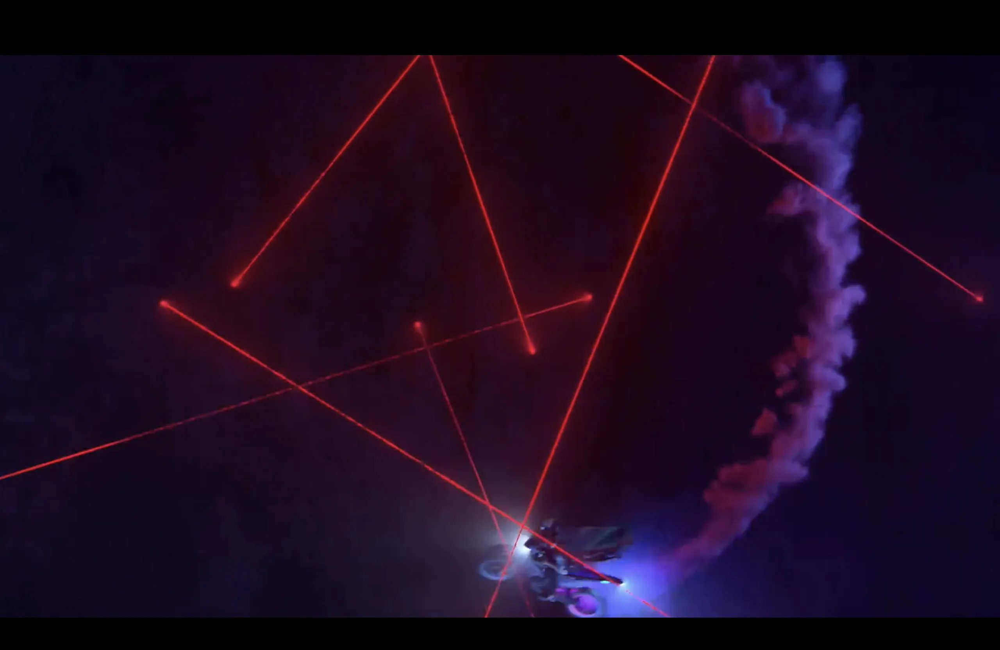
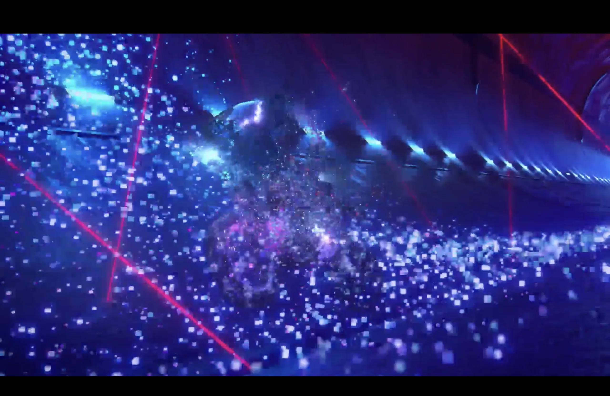



## Overview

Another commercial done at **Moonshine Animation** for ASUS ROG.

---

## My Contributions

| Effect |
|---|
| Smoke simulation |
| Geometry deformation — liquid magnet effect |
| Particle swipe |

---

## Breakdown

### Liquid Magnet Effect

No simulation here. Just vector manipulation — the geometry deforms toward the hand using distance-based math, and you get spikes that follow the finger across the surface. There's also a liquid ripple that spreads outward around the contact point, which adds a lot to the feel of it. The whole thing reads like ferrofluid but there's no sim running under the hood, which keeps it fast and easy to art-direct.

---

### Smoke Simulation

---

### Particle Swipe

Dense field of glowing cube particles sweeping through the scene. The main thing to get right is the directionality. A particle swipe that just appears randomly reads as noise. You want it to feel like it's going somewhere.

