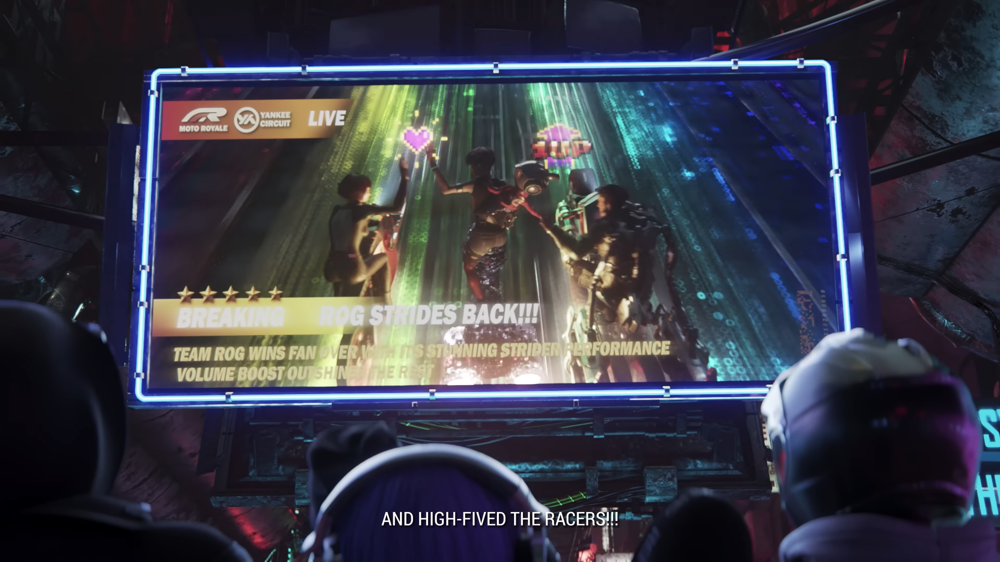
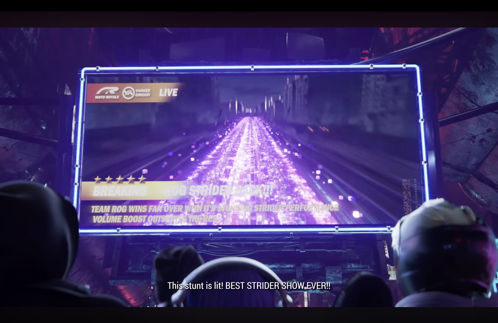
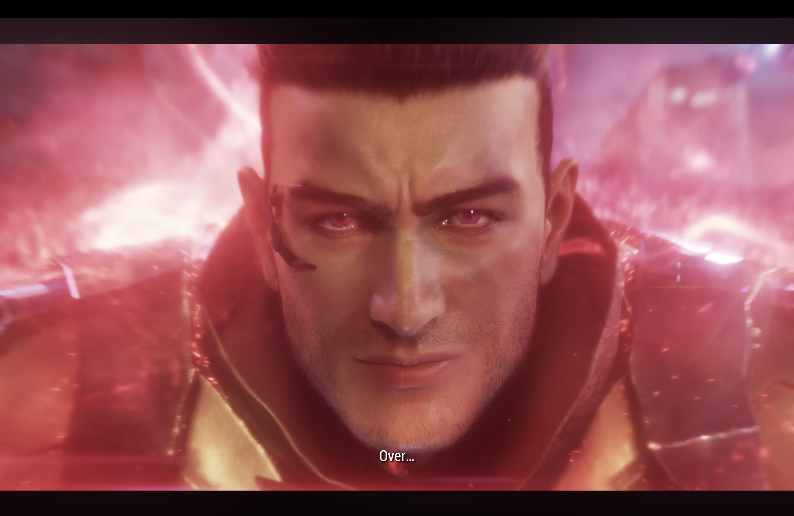
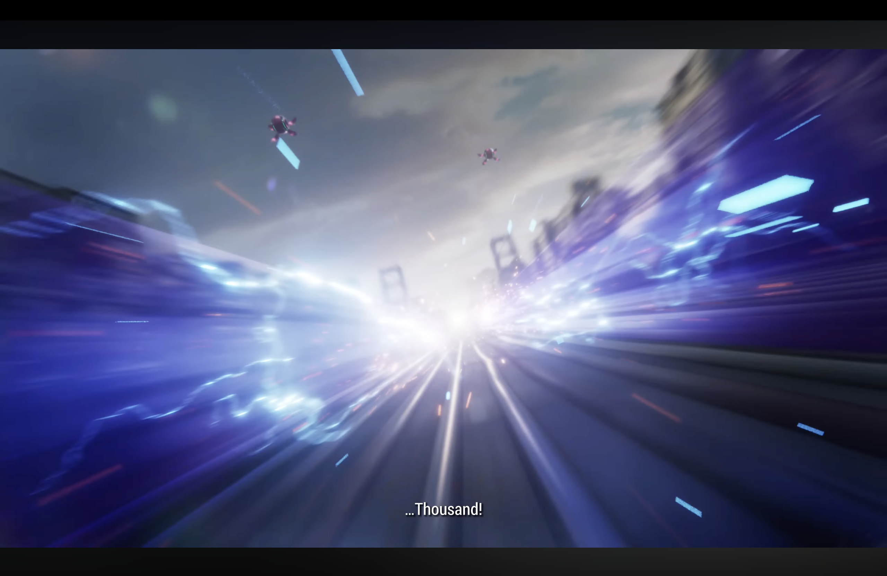
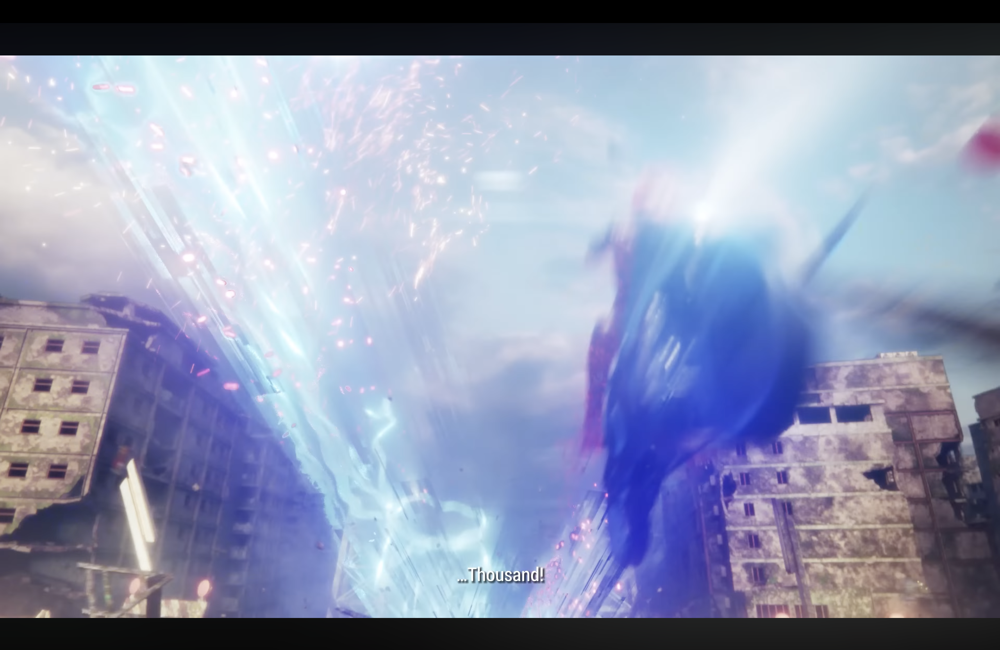
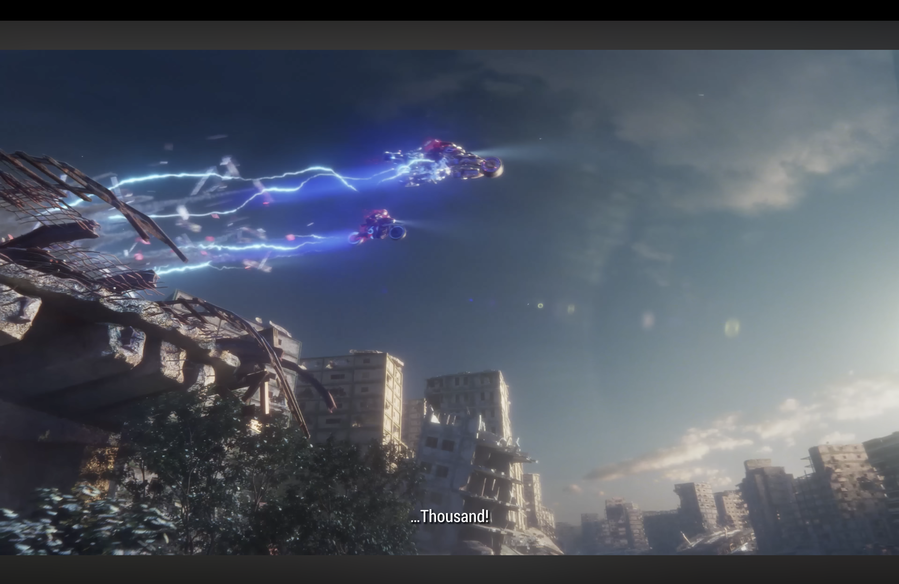
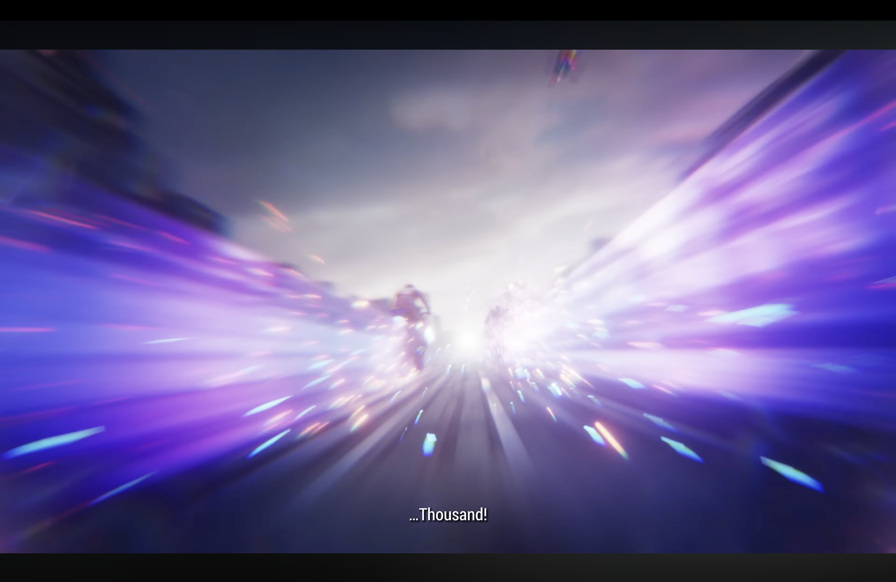
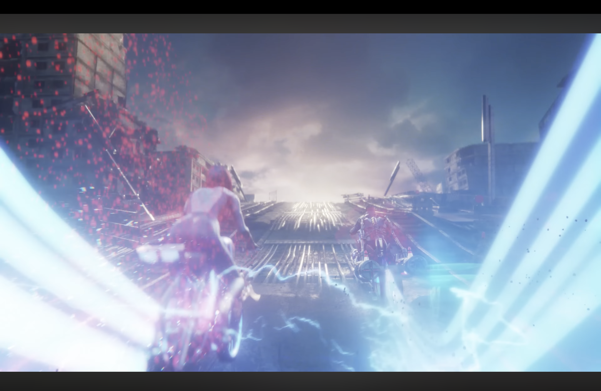



## Overview

**ROG | RE:SET** is a commercial cinematic produced at **Moonshine Animation** for ASUS Republic of Gamers. 

My role focused entirely on the **VFX side**: designing and simulating the effects that punctuate the key story beats. Sparks, lightning strike, every burst of fireworks in this piece went through Houdini.

---

## My Contributions

| Effect | Tool |
|---|---|
| Rainbow effect | Houdini |
| Fireworks & particle simulation | Houdini |
| Smoke simulation | Houdini |
| Lightning effect | Houdini |
| Pixelation effect | Houdini |

---

## Breakdown

### Rainbow Effect

The rainbow streaks appear on the live broadcast screen during the crowd sequence — a wave of colour washing over the arena as the crowd reacts. The effect needed to feel vibrant and slightly surreal to match the cyberpunk aesthetic of the world.

---

### Fireworks & Particle Simulation

Two distinct fireworks moments in the spot. The first is a dense particle trail cascading down the race track — millions of purple embers filling the frame. The second is the hero beat: the ROG logo igniting in the sky as a fireworks burst, a centrepiece shot that needed to read clearly even at distance.

  

    
    
Particle trail — race track sequence

  

  

    
    
ROG logo fireworks — hero beat

  

---

### Lightning Effect

The lightning runs through several shots — from close on the character's face as energy crackles around him, to wide city shots where arcs tear across the skyline. Houdini's wire solver was used to drive the branching behaviour, keeping it physically believable while still being stylised enough to read as supernatural.

  

    
    
Character close-up — energy surge

  

  

    
    
Lightning on the highway

  

  

    
    
Lightning burst — urban combat

  

  

    
    
Lightning arc — wide city shot

  

---

### Speed & Pixelation Effect

The speed effect gives the racing sequences their sense of raw velocity — a radial blur with streaking light that places the camera right inside the action. The pixelation effect is used as a stylistic transition, echoing the digital-glitch visual language of the ROG brand.

  

    
    
Speed effect — race sequence

  

  

    
    
Pixelation effect — transition

  

---

## Reflection

This was one of the more demanding commercial projects I've worked on — tight deadlines, high visual bar, and a lot of effects needing to coexist in the same frame without fighting each other. The biggest challenge was the lightning: making branching arcs feel intentional and art-directed rather than random. A lot of iteration went into the seeding and damping parameters to get the shapes to read well on screen.

Working in Houdini for simulation and handing off to Nuke for compositing was a smooth pipeline, and it was satisfying to see effects that started as point clouds and wire solvers end up in a polished commercial.
