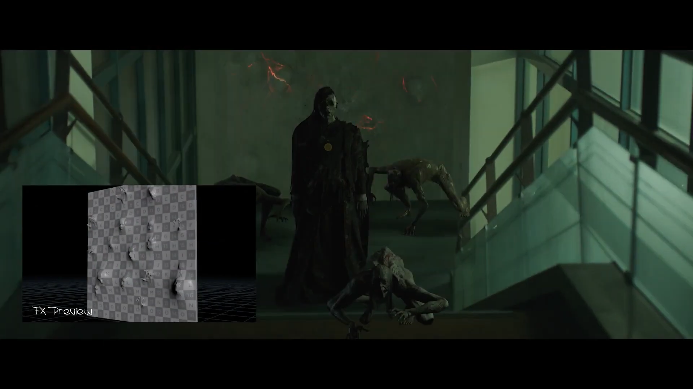
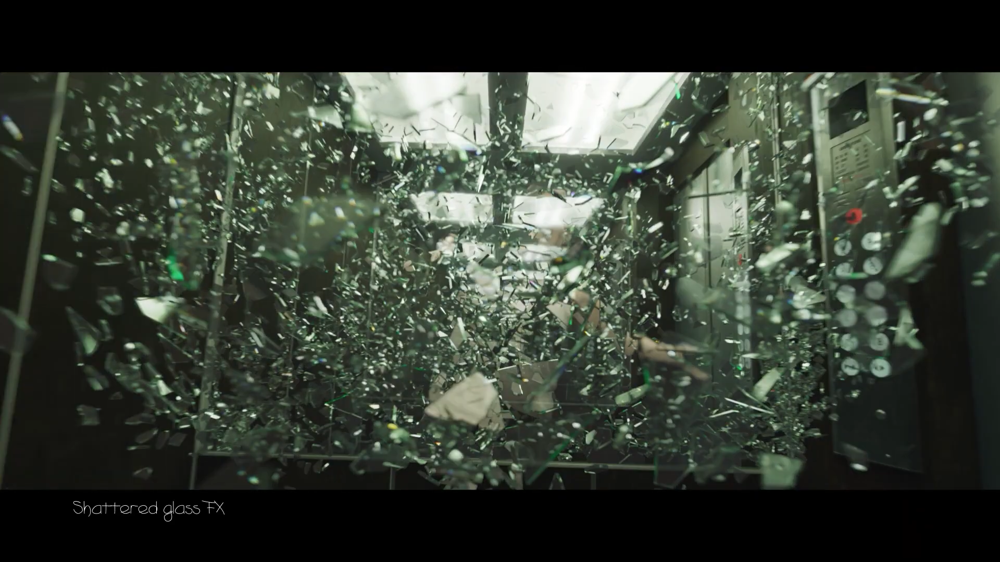
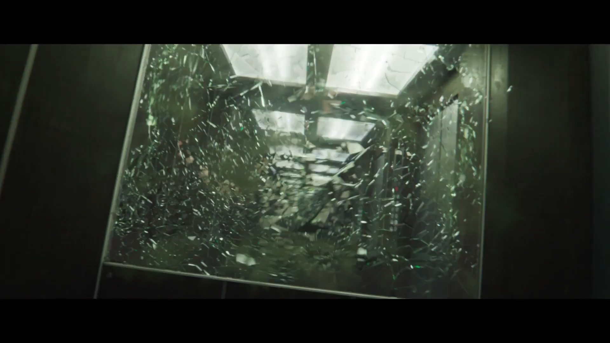
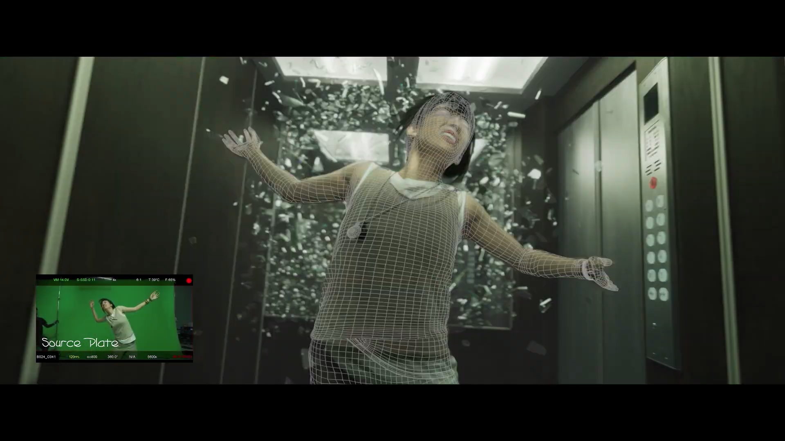



## Overview

All the VFX behind the scenes was done by **Moonshine Animation**. Big team on this one — I handled two effects: the ghost hands and faces coming out of the wall, and the glass shatter in the elevator.

---

## Ghost Hands & Faces Wall

Hands and faces pushing through a wall surface. Initially I wanted to achieve the effect without using Vellum simulation. Then I realized that having an extra layer of motion is pretty nice. So I ended up blending two things together.

---

## Glass Shatter

This one I'm actually proud of. I built a procedural scatter system so the glass pieces are split into layers, and each layer has its own speed and spread. Not everything here is simulation though — a lot of the pieces are just forces, translation and rotation applied directly. Simple stuff, but it works and it gives you control.

The nice thing about having it layered is the director can ask for changes and you just turn a knob. Faster? Slower? Done. You're not re-doing the whole setup every time.

  

    
    
Full glass explosion

  

  

    
    
Looking up through the ceiling

  

The final comp with the actor below is the compositing team's work.

