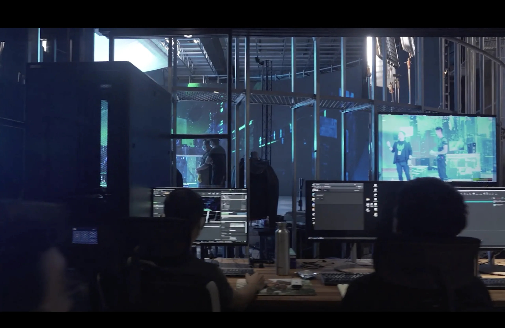
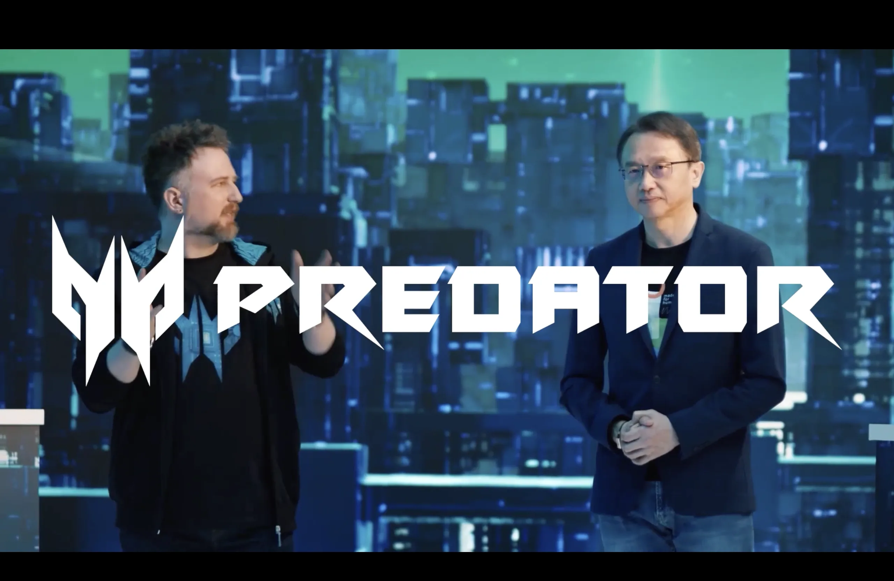
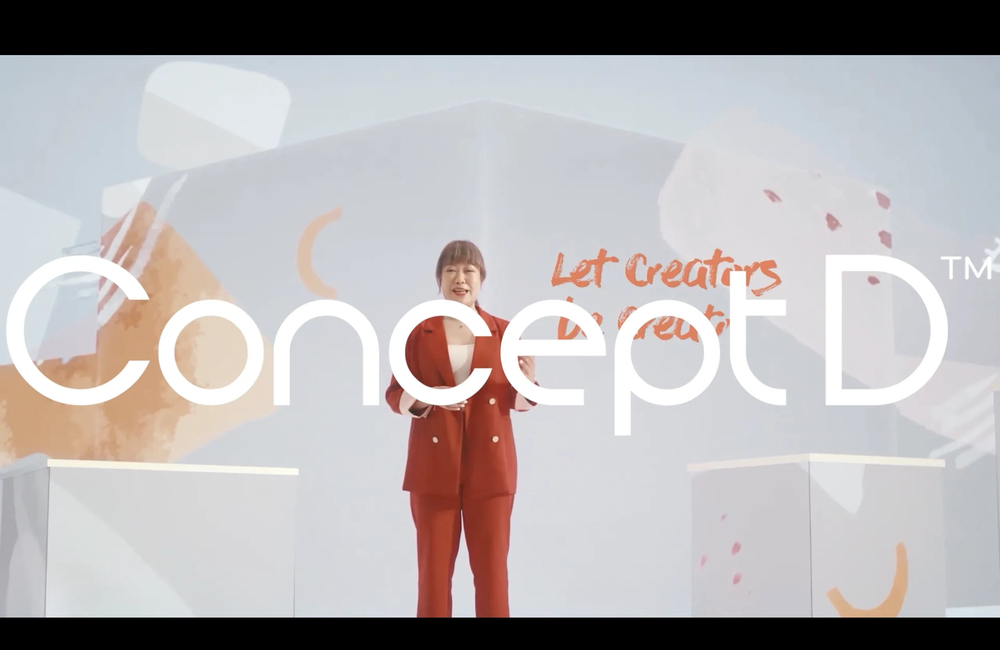
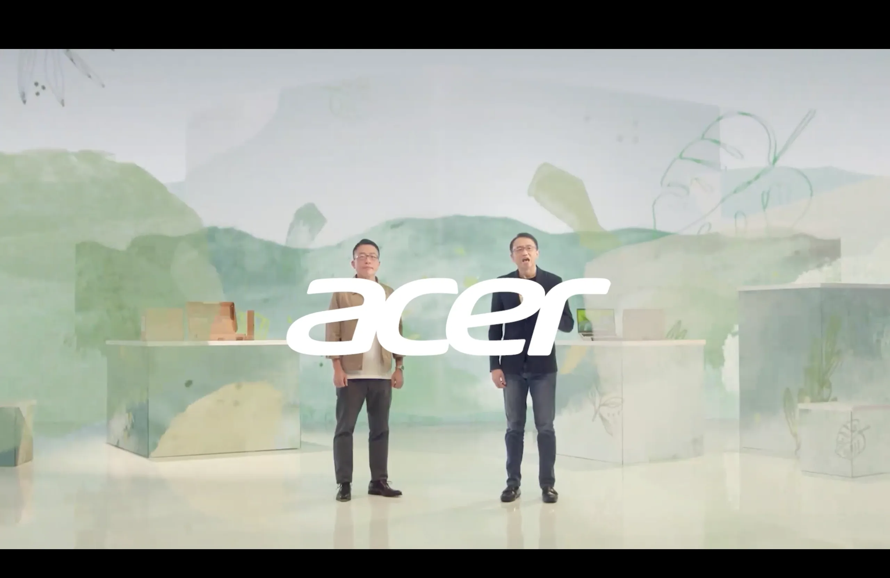



## Overview

This was early in my career at Moonshine Animation, when I was working as a Technical Artist. A virtual production shoot for multiple Acer product lines, all done on an LED stage.

We use Unreal Engine to render the virtual environment in real time and project it onto the LED walls behind the talent. I linked the virtual camera to the real physical camera on set, so when the camera moves, the perspective in UE shifts accordingly — that's what makes it feel like the presenters are actually inside the environment.

My job was running all of this from the control station while the shoot was happening.

---

## On Stage

Three Acer product lines, three different virtual environments.

  

    
    
Predator

  

  

    
    
Concept D

  

  

    
    
Acer

  

